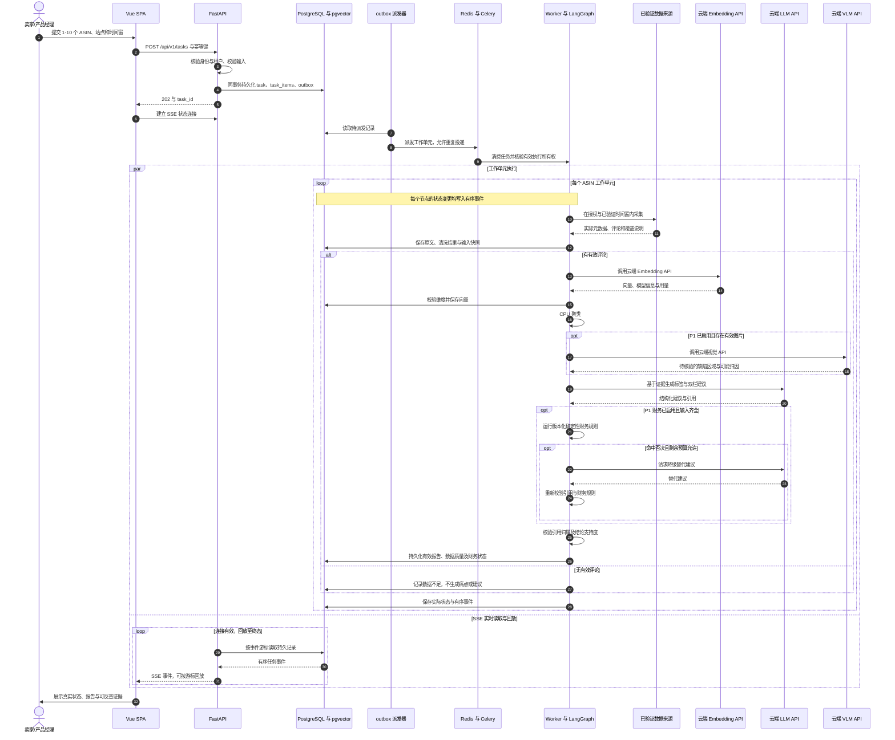

# InsightX · 全球跨境电商 AI 市场洞察与动态决策系统
# 产品需求文档 (PRD)

| 文档版本 | V1.2（2026-09-12：monorepo、全云端模型与验收边界修订） | 编制日期 | 2026-08-22 |
| :--- | :--- | :--- | :--- |
| 项目名称 | InsightX | 适用阶段 | 比赛初赛/复赛 & MVP 研发 |
| 技术方向 | Vue 3 / Vite / TypeScript / shadcn-vue（Tailwind CSS v4）+ FastAPI / LangGraph / Celery + PostgreSQL / pgvector / Redis；LLM、VLM、Embedding 全部使用云端 API | 核心定位 | 工业级出海选品、改款决策与动态风控引擎 |

**实施状态**：本文件定义产品目标，不代表功能已经实现。当前工作区尚无可运行的前后端代码、依赖清单或模型接入；实际完成情况以实施验证与结果记录为准。

**架构依据**：[架构与技术选型](docs/architecture.md)。采用 `frontend/` + `backend/` 的轻量异构 monorepo，Bun/uv 分别管理依赖，前后端仅经 REST + SSE 通信。项目侧只做编排、清洗、CPU 聚类与存储，不部署模型权重或 GPU/CUDA 推理；精确依赖版本、云端供应商与模型 ID 在 M0/M1 验证后锁定，不在 PRD 中固定未经验证的小版本。

---

## 一、产品概述

### 1.1 产品愿景
打破传统跨境电商工具“只给图表不给方案、只推爆款不控风险、只抓文字不管实拍”的行业死结。InsightX 依托多源时序数据采集、多语言向量对齐与多模态 VLM 视觉取证，通过 LangGraph Agent 闭环驱动，为出海企业提供从“海量差评与竞品信号”到“工厂级双栏改款工程清单与逆向财务熔断”的全链路智能决策系统。

### 1.2 目标用户
**核心目标客群**：具备柔性制造与自主开模能力的**工贸一体出海企业、产业带白牌制造厂商及品牌型精细化卖家**（拥有供应链与工厂掌控力，能实质改款优化，非纯铺货跟卖卖家）。

### 1.3 核心价值主张 (Value Proposition)
1. **跨平台时序感知**：多平台（Amazon/TikTok Shop/Temu）同品类数据拉通与价格/流量穿透监控。
2. **多模态物理级诊断**：P1 通过云端 VLM（Claude Vision 方向）辅助识别买家实拍差评图中的色差、破损、断裂等缺陷；定位与归因须核验，不把模型输出当作物理测量或因果证明。
3. **工厂级双栏改款落地**：输出“产品物理本体优化”与“包装履约降本优化”工程级结构化清单。
4. **逆向财务与现金流否决**：内置开模成本、MOQ、抛重比与资金回流约束，向高危内卷项目主动发起熔断警告。
5. **端到端证据溯源与历史回测**：每条建议 100% 绑定原始 Review/图片证据链，支持时间切片后验回测。

---

## 二、用户角色与场景 (User Personas & Scenarios)

| 用户角色 | 核心使用场景 | 核心痛点与诉求 | 期望交付物 (Deliverables) |
| :--- | :--- | :--- | :--- |
| **选品负责人**<br>(Product Sourcing Head) | 新品立项调研、蓝海细分市场发掘、竞品进入壁垒分析 | 依赖人工翻查 H10/JS，缺乏对竞品真实痛点的量化统计；盲目跟风导致进入红海价格战 | • 五维可行性雷达评分<br>• 竞品痛点差异化机会清单<br>• 蓝海价格带与规格空白建议 |
| **产品经理 (PM)**<br>(Hardware / Industrial PM) | 老品改版升级、新品工程定义、打样与模具需求制定 | 传统 VOC 无法区分是“包装摔坏”还是“模具公差”，无法直接给工程图纸提需求 | • 结构化双栏改款清单（本体 vs 包装）<br>• VLM 实拍图缺陷取证报告<br>• 结构防呆与材料升级规格表 |
| **定价与运营**<br>(Operations & Pricing Lead) | 日常价格变动监控、Coupon/促销对冲、Buy Box 防守与掠夺 | 竞品降价或上促销无法小时级感知，被动失守 Buy Box 导致排名腰斩 | • 分钟/小时级竞对异动告警<br>• 智能调价幅度与毛利影响模拟<br>• 历史价格弹性分析曲面 |
| **供应链与库存**<br>(Supply Chain Specialist) | 备货批量决策、包材体积重优化、物流破损防范 | 尺寸超规导致 FBA 履约费暴涨；工厂打样开模周期过长导致错失品类窗口期 | • 包装外箱尺寸降级（Tier Down）方案<br>• FBA 运费节约测算表<br>• 早期质量预警与批次安全库存建议 |
| **企业老板/决策者**<br>(Business Owner / GM) | 立项审批、开模资金拨付、重大战略风险把控 | 工具只吹爆款潜力，隐瞒开模失败、滞销压仓及资金链断裂风险 | • 动态现金流与 ROI 否决/熔断报告<br>• 每周市场竞争打法与选品战略摘要 |

---

## 三、功能清单 (Feature Roadmap)

### 3.1 优先级定义
- **P0（MVP / 初赛核心）**：单品类 Amazon US 单站点已验证 ASIN/时间窗文本闭环、云端 BGE-M3 Embedding + CPU 痛点聚类、云端 LLM 双栏建议、可视化大盘与基础文本证据反查。
- **P1（复赛深化）**：云端 VLM 买家实拍图取证、确定性开模与履约成本否决、图片及深度证据反查。P0 不执行视觉/财务步骤，财务状态为 NOT_EVALUATED。
- **P2（演进扩展）**：历史时间切片回测验证、跨平台（TikTok/Temu）数据对齐、供应链舆情信号监控。

### 3.2 详细功能矩阵

#### 【P0 功能模块】
```
[P0-01] 竞品 ASIN 评论与元数据采集引擎
- 描述：支持单个或批量 Amazon US ASIN，在已验证的数据来源和时间窗内获取商品元数据（标题、价格、BSR、尺寸重量）及近 6 个月评论；缺失字段或不足的时间覆盖如实说明。
- 用户故事：As a 选品负责人, I want to 输入竞品 ASIN 即可获取可用的核心元数据与评论样本, So that 不需要手工导出 Excel 或拼接零散工具。
- 验收标准：
  1. 支持标准 10 位 ASIN 校验，单次提交支持 1-10 个竞品；批次保留每个 ASIN 的独立状态、实际样本量和失败原因。
  2. 200–500 条为样本目标（非普遍承诺）；限定已验证 ASIN/站点/时间窗，记录实际数量、缺失原因与分布，不足如实展示、禁止补造；95% 成功率须先定义成功条件/样本集/观察周期。自动剔除无意义短评（如 "ok", "fast"），保留清洗数量与规则记录。
  3. 原始评论、来源、评论/采集时间及输入快照结构化保存至 PostgreSQL；缺失不伪填，合成 fixture 不能作为真实采集数据。
  4. 零有效评论时展示“数据不足”，不继续生成虚构痛点或建议；采集失败与成功采集但无数据须区分。

[P0-02] 多语言痛点语义对齐与聚类分析
- 描述：后端调用云端 BGE-M3 Embedding API（1024 维 Dense 基线），向量由 pgvector 存储/检索，Worker 使用 scikit-learn 在 CPU 上执行聚类，云端 LLM 根据证据归纳标签。展示有支持证据的最多 5 类核心痛点。
- 用户故事：As a 产品经理, I want to 看到系统自动按严重度和频次汇总的买家高频痛点, So that 我无需人工逐条阅读几千条外语评论。
- 验收标准：
  1. 以质量、功能、尺寸、配件、说明书等维度归纳痛点，在固定多语言标注样本上验证质量；阈值与验收口径在 M0 确定，不凭空承诺准确率。
  2. 输出痛点名称、实际频次及统计口径、严重度评分（1-5分）与依据、可回查的典型原声；不足 5 类不补足，低支持结果明确标识。
  3. 德/日/西等多语言评论对齐到统一中文/英文标签；测试语言覆盖和缺失情况可追踪。
  4. 云端 Embedding 候选为 SiliconFlow 的 BAAI/bge-m3，需验证实际账户、返回维度、批量顺序和输入限制后锁定；不同供应商/模型/维度的向量不得默认混用。不要求部署本地权重或 GPU，HNSW 仅在规模与召回验证后作为可选优化。

[P0-03] 结构化双栏改款建议生成引擎
- 描述：基于痛点聚类及真实引用，云端 LLM 生成“产品本体优化”与“包装履约优化”两栏建议；具体 Claude 模型 ID 通过 M0 验证后锁定。
- 用户故事：As a 产品经理/供应链专家, I want to 获得清晰拆解为产品改款和包装改进的工程清单, So that 我能分别对接模具厂与包装厂。
- 验收标准：
  1. 严格分为两栏输出：左栏（材质、结构、模具公差方向）、右栏（包材抗震、尺寸降阶方向、组装说明）。
  2. 每条方案具备改动描述、痛点编号与同租户/同任务快照的评论或片段引用；既检查结构也检查引用内容是否支持结论。
  3. 前端双栏卡片支持基础原始评论反查；无证据的结论不作为有效建议，不虚构工程尺寸、费用或收益。
  4. 记录模型、prompt 版本与实际用量；云端失败显式展示，不能用本地推理或假报告静默替代。

[P0-04] 交互式洞察大盘与任务流看板 (Dashboard)
- 描述：统一的 Vue 3 + Vite + TypeScript + shadcn-vue Web 界面，使用主题变量/组件样式展示任务执行进度、指标、痛点图表和报告，不同时引入第二套 UI 体系。
- 用户故事：As a 决策者, I want to 在一个页面总览所有监控 ASIN 的关键指标与诊断结果, So that 快速评估竞品态势。
- 验收标准：
  1. 展示实际样本量、样本平均星级、样本差评占比及有证据的痛点数量，并标注时间窗与统计口径；不能把采样指标冒充商品总体指标。
  2. 改款潜力指数需有明确算法/证据；P0 未执行的 FBA 节约额与财务裁决显示“未评估”，不能显示为 0 或默认通过。
  3. 集成 ECharts 痛点分布柱状/雷达图，数据不足时展示空态而非假数据。
  4. SSE 展示实际节点与每个 ASIN 的状态，支持断线后的有序事件回放、去重及报告恢复查询；不依赖固定七步动画。
```

#### 【P1 功能模块】
```
[P1-01] VLM 买家实拍图多模态缺陷取证
- 描述：通过经验证支持视觉的云端 Claude API 辅助识别色差、运输破损、结构断裂、毛刺飞边等缺陷；不部署本地视觉模型。
- 用户故事：As a 产品经理, I want to 看到买家实拍图中产品具体损坏部位的标注与成因分析, So that 避免因文字描述模糊导致改错模具。
- 验收标准：
  1. 获取合法有效的买家实拍图，过滤与诊断无关的图片，并保留图片和原始评论的关联。
  2. 输出结构化缺陷类型、模型置信度与可能归因；坐标处理缩放映射并抽样复核，不将定位或归因当作物理测量/因果证明。
  3. 视觉证据与评论、建议精准绑定；模型无法判断或调用失败时如实标记，不阻断可独立完成的文本结果。

[P1-02] 逆向财务约束与现金流否决引擎 (Financial Veto)
- 描述：使用版本化的确定性公式，根据开模成本、打样周期、预估销量、抛重比等输入判断 ROI 与回本周期；LLM 只解释裁决或提出替代建议，不自行决定财务是否通过。
- 用户故事：As a 决策者/老板, I want to 系统在预期收益无法覆盖改款成本或周期过长时主动叫停, So that 避免盲目投入导致资金链断裂。
- 验收标准：
  1. 支持模具费（USD）、MOQ、当前毛利率、期望回本月数等输入，记录费率来源、币种/单位、规则版本及所用假设；缺失关键输入为 NOT_EVALUATED。
  2. 命中经确认的否决规则时输出红色警示与可复算理由。成本增额超过毛利 35%、周期超过品类半衰期等仅为规则示例，实际阈值与单位需验证，不能直接当成通用默认值。
  3. 提供免开模小改、仅优化包装等替代建议，重新评估仍遵守规则与任务预算，不能凭模型口头说明将 VETOED 改成 PASSED。

[P1-03] 全链路证据端到端反向溯源
- 描述：决策报告中每一项痛点与改款建议均可点击穿透，查看支撑该结论的原始 Review 文本、时间戳、星级、原声翻译及实拍图。
- 用户故事：As a 运营负责人, I want to 点击改款建议直接看到对应的真实差评出处, So that 确保 AI 建议真实可信而非模型幻觉。
- 验收标准：
  1. 改款卡片标注引用证据数量（如：Based on 42 Reviews & 8 Photos）。
  2. 点击抽屉弹窗展开原始证据列表，支持按星级、时间筛选。
  3. 证据高亮显示核心抱怨关键词。
```

#### 【P2 功能模块】
```
[P2-01] 历史时间切片回测验证系统 (Backtesting)
- 描述：按时间截断历史数据（如取 2025 年 Q1 数据），由 Agent 给出改款建议，对比该品类后续真实市场演变，计算预测吻合度。
- 用户故事：As a 选品负责人, I want to 查看模型在历史时间节点上的建议是否与后来爆款走势一致, So that 建立对系统决策逻辑的信任。
- 验收标准：
  1. 支持选择历史时间切片点（如 6 个月前）。
  2. 输出后验吻合度评分（Backtest Accuracy Score），明确样本、时间截断和评分口径；说明云端模型可能已有后续知识，不声称消除了全部未来信息泄漏或证明因果关系。

[P2-02] 跨平台 SKU 动态映射与套利空间洞察
- 描述：打通 TikTok Shop 与 Temu 数据，基于跨语种图文特征实现同款商品自动对齐，发现价格差与供需洼地。
- 用户故事：As a 选品与定价运营, I want to 看到同款商品在 Amazon、TikTok、Temu 的价格差异与流量热度, So that 制定跨平台出海定价打法。
- 验收标准：
  1. 实现跨平台同款 SKU 自动推荐度匹配（Match Score）。
  2. 提供三平台价格对比与佣金履约成本测算表。

[P2-03] 供应链风险与物流异常预警
- 描述：监控公开运价指数、海运港口拥堵、原材料价格波动与工厂交期舆情，输出安全库存微调建议。
- 用户故事：As a 供应链负责人, I want to 提前获取关键原材料涨价与航线延误信号, So that 提前调整采购节奏与出运计划。
```

---

## 四、信息架构与导航设计 (Information Architecture)

以下是完整演进导航，不代表 P0 全部上线。P0 仅验收文本任务、痛点、双栏建议和基础证据；视觉、财务、回测及跨平台区域按对应阶段开放，未实现部分不得展示伪运行结果。

```
InsightX 平台架构
├── 顶栏导航 (Header)
│   ├── 项目/品类切换选择器
│   ├── 快速创建诊断任务 (New Audit Task)
│   ├── 系统实时告警中心 (Alerts)
│   └── 用户与企业账套设置 (Settings)
│
├── 侧边栏主导航 (Sidebar Navigation)
│   ├── 1. 战略决策大盘 (Overview Dashboard)
│   │   ├── 核心 KPI 卡片区
│   │   ├── 任务执行进度与实时流
│   │   └── 风险熔断待办项
│   │
│   ├── 2. 竞品时序监控 (Competitor Radar)
│   │   ├── 竞品列表与 BSR 走势
│   │   ├── 价格与 Buy Box 波动监控
│   │   └── 跨平台 SKU 映射矩阵 (P2)
│   │
│   ├── 3. 多模态评论洞察 (VOC & Vision Audit)
│   │   ├── 痛点聚类分析分布
│   │   ├── 买家实拍图缺陷画廊
│   │   └── 多语言声量情感矩阵
│   │
│   ├── 4. 工厂级改款决策 (Reformulation Engine)
│   │   ├── 双栏决策看板（产品本体 vs 包装履约）
│   │   ├── 证据链穿透抽屉 (Evidence Trace)
│   │   └── 改款工程规格书导出 (PDF/Excel)
│   │
│   └── 5. 逆向财务与风控熔断 (Financial Guard)
│       ├── 开模成本与 ROI 测算器
│       ├── 包装抛重与 FBA 降档模拟
│       └── 历史回测验证中心 (P2)
```

---

## 五、核心页面描述与交互规范

### 5.1 战略决策大盘 (Dashboard)
- **页面定位**：系统首屏，聚合展示企业监控品类的全局体检状态、待处理高危竞品及改款机会推荐。
- **布局要点**：
  1. **Top KPI Row**：展示本批竞品数、实际样本量与有证据的痛点数量；P0 的 FBA 金额、财务熔断数等未执行指标标记未评估，样本统计注明口径。
  2. **任务流快速触发器**：输入 Amazon ASIN / 可识别商品 URL + Amazon US 站点与时间窗，提交异步任务；开模预算等财务输入属于 P1，不作为 P0 必填门槛。
  3. **实时 Agent 执行流面板**：SSE 展示真实节点、批次/单 ASIN 状态和耗时；区分跳过、无数据、失败与取消，支持断线回放。关闭页面不自动取消任务。
  4. **高潜改款项目推荐卡片**：只展示有支撑数据的结果；不足 Top 3 不补齐，ROI 与退货率压降预期只有在对应评估已执行且依据齐全时展示。

### 5.2 多模态评论洞察页 (VOC & Vision Audit)
- **页面定位**：深度展示从文本评论与实拍图中挖掘出的物理缺陷分布。
- **布局要点**：
  1. **痛点聚类排行榜**：左侧展示 Top 痛点树状列表，带严重度徽章（Critical / Moderate / Minor）及频次百分比。
  2. **多模态取证画廊（P1）**：展示买家实拍图及云端 VLM 返回的缺陷区域（如“把手断裂处”、“外壳色差”），处理坐标缩放并标识待复核的置信度与可能归因；没有可靠定位时不伪造边界框。
  3. **多语言过滤条**：支持切换德语、日语、西语原声与翻译对照视图，支持按 1-3 星筛选理性吐槽评论。

### 5.3 工厂级双栏改款决策页 (Reformulation Engine)
- **页面定位**：核心交付物页面，直观呈现面向工程与供应链的落地方案。
- **布局要点**：
  1. **左栏：产品物理优化栏 (Product Body Optimization)**
     - 结构设计防呆、材质替换等级（如 ABS $\rightarrow$ 阻燃 PC）、模具拔模斜度修正。
     - 标注：预计开模费用（$）、改模周期（天）、预计降低产品自身缺陷率（%）。
  2. **右栏：包装与履约优化栏 (Packaging & Fulfillment Optimization)**
     - 包装材料抗摔升级（如蜂窝纸板垫块）、外箱几何尺寸缩减方案。
     - 标注：外箱尺寸变化对比（$L \times W \times H$）、抛重变化、FBA Size Tier 变化、单件运费节省额（$）。
  3. **交互规范**：
     - 每条建议右侧带“查看证据链”按钮，点击后右侧滑出抽屉，高亮呈现对应原始评论与图表证据。
     - 底部提供“一键导出工程改款任务书 (Engineering RFC)”按钮。

P0 双栏卡片优先交付有证据的改动方向与基础文本反查；上述工程数值、周期和金额只有在输入及评估依据齐全时才能展示，缺失时标记未评估，不让 LLM 补造。工程任务书导出属于后续演进，不是 P0 的伪占位交付。

### 5.4 逆向财务风控与熔断详情页 (Financial Guard)
- **页面定位（P1）**：把控商业合理性，防止盲目开模与高危立项；P0 不执行财务否决。
- **布局要点**：
  1. **财务参数调节滑块**：用户可调整开模预算、打样成本、首批 MOQ、预期售价、海运单价；保留币种/单位和参数依据。
  2. **动态盈亏平衡与敏感度曲线**：ECharts 展示确定性公式计算的回收期，区分输入假设与真实市场结果，前端不自行重算裁决逻辑。
  3. **熔断决议状态区 (Veto Banner)**：
     - **NOT_EVALUATED（未评估）**：P0、未运行财务步骤或缺失必要输入；不等于通过或 0 收益。
     - **PASSED（绿灯）**：在已记录输入和规则版本下满足门槛，不等于保证商业成功。
     - **VETOED（红灯熔断）**：展示可复算的理由与替代建议；示例数字不作为实际计算结果或默认业务阈值。

---

## 六、数据流与状态机说明 (Dataflow & State Machine)

### 6.1 端到端数据流转图

以下是目标流程，不是已实现接口。创建资源拟为 `POST /api/v1/tasks`；正式 REST/事件结构以后端 DTO 导出的 OpenAPI 与事件 schema 为准，前端客户端由该契约生成。



采集、云端调用、节点或 Worker 失败时记录原因与可恢复状态，不把失败当作无数据。事件、报告和 LangGraph checkpoint 各有职责：业务记录与有序事件在 PostgreSQL 持久化，checkpointer 用于图恢复，重放仍需幂等；它们不是天然跨步骤原子事务。SSE 断开不取消任务，取消由 REST 显式提交并在节点边界处理。

### 6.2 任务、工作单元与图状态（概念模型）

以下是需求级状态边界，不是仓库中已有的 Python 类型或数据库 schema。

| 维度 | 必须表达的信息 |
| --- | --- |
| 批次任务 | task_id、已核验租户、站点/时间窗、1–10 个 ASIN 工作单元及其汇总结果 |
| 单 ASIN 工作单元 | task_item_id、ASIN、输入快照、当前节点、尝试/执行所有权、取消与错误信息 |
| 图恢复状态 | 与工作单元绑定的稳定 thread 标识、checkpoint 和可重放步骤；不将大图片或完整业务报告重复当成图状态存储 |
| 生命周期 | 目标状态 QUEUED、RUNNING、COMPLETED、FAILED、CANCELED；批次展示必须保留每个子项失败/取消原因，不能以“完成”掩盖部分失败 |
| 数据质量 | 样本充足、部分缺失或无有效数据；与技术执行成败分离，零有效评论不生成建议 |
| 财务裁决 | NOT_EVALUATED / PASSED / VETOED；P0、未执行或输入不足为 NOT_EVALUATED，不由任务终态推导 |
| 证据与模型元数据 | 评论/片段/图片引用、快照、供应商/model_id、Embedding 维度与版本、prompt 版本、实际用量及可获取的请求 ID |
| 实时事件 | 版本、事件 ID、类型、任务/工作单元、时间与 payload；由持久记录回放，前端去重 |

---

## 七、非功能性需求 (NFR)

### 7.1 性能与响应时效 (Performance)

下列数值是**待实测确认的工程目标**，不是当前实现成绩或无条件承诺。M0/M1 应记录样本、部署区域、硬件、并发、供应商限流、缓存与测量方法；若需调整验收值，须提出修订并重新确认，不能在实现中悄悄放宽。

1. **基础查询**：P95 延迟目标 <= 200ms；限定不含云模型/采集调用的数据库基础查询，注明数据规模、请求起止点及网络边界。
2. **P0 任务总耗时**：单 ASIN、500 条有效评论的文本闭环以 30–60 秒为候选目标，从创建成功计时到报告可取，包含排队、采集和云端 API 等待；分段报告耗时并区分缓存命中/未命中。P1 视觉与财务路径另行评估，样本不足不补齐后参与测试。
3. **向量检索**：10 万条同模型/同维度向量数据的 Top 50 余弦检索以 <= 50ms 为工程目标；测量数据库执行耗时，注明租户/时间窗过滤、索引、实际返回数及召回口径，不含云端生成向量的时间。P0 不因此强制引入 HNSW。
4. **SSE**：同一事件 ID 从持久事件提交到前端呈现的时延目标 <= 300ms；注明连接数、网络、测量时钟与代理配置，节点处理/写入耗时另行记录。

### 7.2 安全与合规性 (Security & Compliance)
1. **身份与租户隔离**：P0 使用受控账号和最小服务端会话；后端核验用户与租户成员关系，不能信任客户端 tenant_id。REST、SSE 回放、证据、缓存和 Worker 均需越权/隔离测试，未通过不得作为公开多租户服务交付。
2. **浏览器与密钥安全**：优先同域反向代理，使用 HttpOnly/Secure/SameSite cookie 和写操作 CSRF 防护；前端不持久化 bearer token、不在 SSE URL 放长期凭证、不直连模型。模型/数据供应商密钥只从服务端受控配置加载，禁止硬编码和日志泄漏。
3. **传输与存储保护**：通过 TLS、基础设施存储/备份加密、最小权限和密钥管理提供可核验证据，不仅用“强加密”作描述；具体云平台配置由部署任务确认。
4. **合规采集与云端处理**：数据来源、抓取速率、可用时间窗与原文/图片使用权限须验证。模型上传最小必要数据，不默认上传完整财务资料或图纸；核对个人信息处理、区域、保留/训练条款与跨境要求，未经核验不得声称零保留或不用于训练。

### 7.3 可用性与容错 (Availability & Reliability)
1. **服务可用性**：保留 SLA >= 99.5% 为生产目标；统计周期、探针、依赖故障和降级口径需在部署验收中明确。单机 Compose 和本次文档设计都不等于已达标。
2. **云端调用容错**：LLM/VLM/Embedding 均有超时、并发和费用预算。对可恢复错误指数退避；同一次操作最多重试 3 次（不含初次请求，SDK 重试计入这 3 次），有 Retry-After 时遵守；鉴权、模型不可用或额度耗尽不无限重试。节点恢复与队列重投不能绕过统一预算。
3. **降级透明**：P1 视觉失败不阻断可独立完成的文本结果，但必须标记视觉未完成；关键 Embedding/LLM 失败时只使用合法且配置匹配的已验证缓存，或明确失败/标记受影响部分未完成。不切回本地推理、不生成假向量或假报告。
4. **幂等与恢复**：任务创建采用幂等键与事务 outbox；验证重复消息、派发/Worker 崩溃、超时、取消和 checkpoint 重放。缓存按租户、输入快照/内容、供应商/模型与版本区分，不仅按 ASIN 复用；模型或维度切换须评审向量重建范围。
5. **验证与费用隔离**：普通 CI 使用明确标识的 fixture/mock；真实云端模型、数据采集和质量验证单独批准并限额执行。测试替身不能当作已接通模型、真实来源或性能达标证据。

---

## 八、MVP 范围定义 (Scope Definition)

| 阶段 | 交付范围 | 验收边界 |
| --- | --- | --- |
| P0：单平台采集 | Amazon US、单品类、1–10 个已验证 ASIN/时间窗；评论与元数据快照 | 200–500 条仅为样本目标；记录实际量、缺失和清洗情况，零有效评论不生成建议 |
| P0：文本分析 | 云端 BGE-M3 Embedding + CPU 聚类 + 云端 LLM 标签与双栏建议 | 最多 5 类有证据痛点，不补造；不部署本地模型，不以 HNSW 为无条件前置 |
| P0：看板与基础溯源 | Vue/shadcn-vue/ECharts、真实 SSE 节点与工作单元状态、建议关联原始评论 | 验证断线回放、恢复、取消、部分失败与租户隔离；财务 NOT_EVALUATED |
| P1：视觉取证 | 云端 VLM、实拍图关联、区域定位及深度证据反查 | 坐标/可能归因需复核，失败标记不伪装成功 |
| P1：财务风控 | 有依据的开模/履约输入、版本化确定性公式、否决及替代建议 | 未执行或输入不足为 NOT_EVALUATED，裁决与任务终态分离 |
| P2：演进分析 | 历史时间切片回测、TikTok/Temu SKU 映射、供应链信号 | 独立验证数据、评分口径与局限，不作为 P0/P1 已完成能力 |
| 后续工程导出 | 专业改款任务书 / RFC（PDF、Word、Excel 等需求按阶段确认） | 保留演进方向，不作为 P0 必需功能或伪占位交付 |

---

## 九、里程碑与排期建议 (Milestones & Schedule)

排期为建议而非完成记录。先验证数据与云端模型，再搭建和联调；M0 未通过时如实记录阻塞，不以日历进度视为验收完成。后续实施逐项遵守计划、审批、验证与结果记录流程。

| 阶段 | 周期 | 核心里程碑交付物 | 关键责任模块 |
| :--- | :--- | :--- | :--- |
| **M0-A: 数据与云端模型验证（前置）** | 第 0–1 周 | • 5–10 个 child ASIN 授权试采，核验原文/分页/时间覆盖/费用<br>• 云端 LLM 与 Embedding 的账户/区域、model_id、维度/批量限制、小样质量、错误处理及任务成本验证<br>• P1 图片/云端 VLM 可行性单列记录，不冒充 P0 已完成 | 后端/数据、AI、产品 |
| **M1: 架构与原型搭设** | 第 1 周 (Day 1-7) | • 初始化轻量 monorepo（frontend/ + backend/），Bun/uv 锁定经验证依赖<br>• PostgreSQL/pgvector 与 Alembic、Linux 容器健康/迁移就绪验证<br>• OpenAPI/事件契约与前端客户端生成、Vue/shadcn-vue 大盘原型 | 全员 / 前端 |
| **M2: P0 核心数据与算法闭环** | 第 2 周 (Day 8-14) | • 先打通一个真实 ASIN 的采集、云端 Embedding、CPU 聚类及云端双栏建议，再扩展批次<br>• pgvector 精确检索、引用校验与报告<br>• Celery/outbox、LangGraph checkpoint 与持久任务事件闭环 | 后端 / AI 核心 |
| **M3: 前后端联调与初赛交付** | 第 3 周 (Day 15-21) | • REST + EventSource 同域代理联调，SSE 回放与报告恢复查询<br>• 双栏/基础证据、无数据、部分失败、取消、Worker 恢复和租户隔离验收<br>• **完成真实能力范围内的初赛 Demo 录屏与申报材料** | 全员 |
| **M4: P1 多模态与财务风控增强** | 第 4 周 (Day 22-28) | • 经验证的云端 VLM 接入、图像坐标/证据核验与降级<br>• 版本化确定性财务否决、履约测算和替代建议<br>• 深度证据反查完善 | AI 核心 / 后端 |
| **M5: P2 回测体系与多平台扩展** | 第 5 周 (Day 29-35) | • TikTok/Temu 授权样本、供应链信号与时间切片回测<br>• 明确评分与知识泄漏局限<br>• 依据压测和召回结果评估 HNSW 等优化 | 全员 |
| **M6: 决赛演练与上线发布** | 第 6 周 (Day 36-40) | • Linux Docker Compose 部署、备份/恢复与健康检查验证<br>• 云端调用预算、依赖故障与演示预案<br>• 现场 PPT、Demo 演讲稿与真实验证结果记录 | 全员 / 队长 |

---
*本 PRD 定义需求、目标与验收方向；架构选择见 docs/architecture.md，实际实施完成须有验证证据和对应 result.md。*
