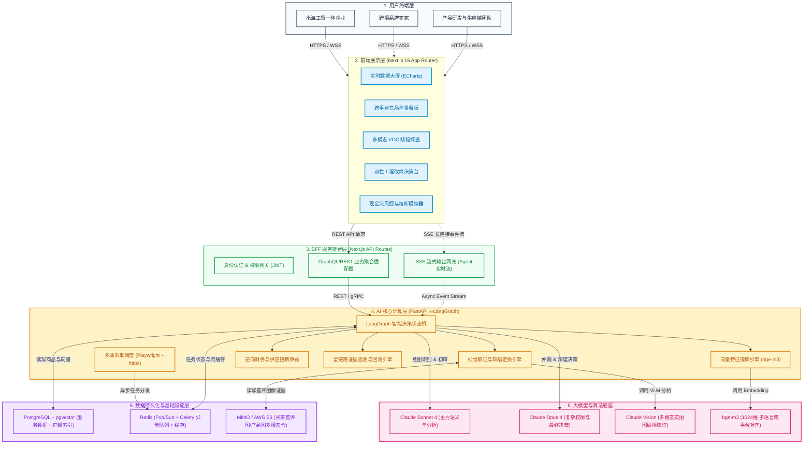
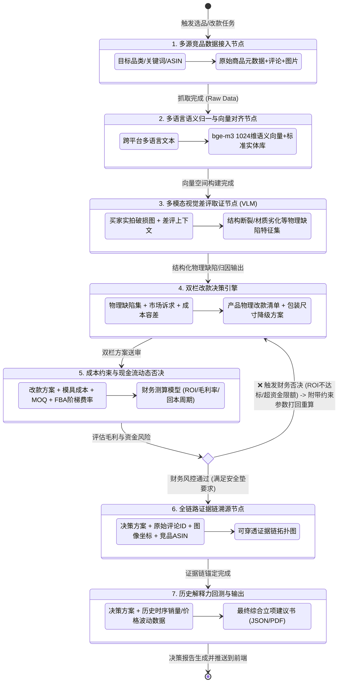

# InsightX · 系统架构与业务流程图全景

本文档包含 **InsightX · 全球跨境电商 AI 市场洞察与动态决策系统** 的核心技术架构、Agent 状态机编排、数据处理流、前端功能站点导航及双模式部署拓扑图。所有图表均基于 Mermaid 标准语法构建。

---

## 1. 系统整体架构图（分层架构）

**架构说明**：系统采用现代化前后端分离与微服务架构。前端基于 Next.js 16 + shadcn/ui + ECharts 提供交互分析与数据可视化看板；BFF 层通过 Next.js API Routes 承担鉴权、聚合与 SSE 流式事件透传；AI 核心服务采用 Python FastAPI + LangGraph 实现多 Agent 状态机调度；底层依托 PostgreSQL + pgvector 提供结构化与向量混合检索，Redis 支撑任务队列与高频缓存，MinIO/S3 存储海量买家实拍多模态证据。



---

## 2. LangGraph Agent 决策工作流图（状态机）

**流程说明**：系统以 7 步闭环 Agent 状态机为核心。从竞品数据接入开始，经过多语言对齐与多模态实拍图取证，生成“产品本体+包装履约”双栏改款方案；随后进入“成本约束与现金流否决”校验节点，若财务 ROI 或现金流安全垫不达标，触发**条件回退边**，将约束参数打回改款引擎降级重算；通过后进行全链路证据绑定与历史解释力回测，最终输出高置信度立项决策报告。



---

## 3. 全生命周期数据流图

**数据流说明**：展示数据从外部电商平台采集、中间清洗向量化、分层存储、混合检索、多模型协同分析，到最终结构化决策产出的端到端路径，明确标注各阶段的**数据格式**与**存储介质**。

```mermaid
flowchart LR
    %% 外部数据源
    subgraph DS ["外部数据源 (Multi-Source)"]
        DS_AMZ["Amazon (Listing/Reviews/Images)"]
        DS_TK["TikTok Shop (短视频反馈/带货SKU)"]
        DS_TEMU["Temu (价格带/买家秀)"]
    end

    %% 阶段1：采集与预处理
    subgraph P1 ["阶段 1: 采集与解析"]
        C_Worker["Playwright / httpx 爬虫集群"]
        C_Raw["原始文本 HTML / JSON / JPG 图像"]
    end

    %% 阶段2：向量化与存储
    subgraph P2 ["阶段 2: 归一化与存储"]
        V_Embed["bge-m3 语义向量化"]
        V_OSS["图像流落盘 (MinIO/S3)"]
        V_PG["PostgreSQL (结构化数据)"]
        V_Vec["pgvector (1024维向量表)"]
    end

    %% 阶段3：混合检索与组装
    subgraph P3 ["阶段 3: 混合检索与证据组装"]
        R_Hybrid["Hybrid Search (BM25 + 向量近似)"]
        R_Context["结构化上下文 (JSON Context Window)"]
    end

    %% 阶段4：AI 多模态推理
    subgraph P4 ["阶段 4: 模型推理与风控校验"]
        M_VLM_Run["Claude Vision 图像缺陷定损"]
        M_LLM_Run["Claude Sonnet/Opus 逻辑决策"]
        M_Sim_Run["Python 财务与 FBA 尺寸精算"]
    end

    %% 阶段5：终端呈现
    subgraph P5 ["阶段 5: 业务决策输出"]
        OUT_Report["双栏改款清单 (JSON Schema)"]
        OUT_Stream["SSE 实时日志与图表渲染"]
    end

    %% 数据流连接
    DS_AMZ & DS_TK & DS_TEMU -->|HTTP GET/API| C_Worker
    C_Worker -->|格式化提取| C_Raw
    
    C_Raw -->|文本流 (UTF-8)| V_Embed
    C_Raw -->|二进制图片 (Base64/Binary)| V_OSS
    C_Raw -->|结构化元数据 (JSONB)| V_PG
    
    V_Embed -->|Float Array| V_Vec
    
    V_PG & V_Vec -->|SQL + Vector Cosine Query| R_Hybrid
    V_OSS -->|Signed URL / Image Bytes| R_Hybrid
    
    R_Hybrid -->|RAG 上下文载荷| R_Context
    
    R_Context -->|提示词 + 图像 URL| M_VLM_Run
    R_Context -->|提示词 + 评论聚类| M_LLM_Run
    M_LLM_Run -->|参数化工程方案| M_Sim_Run
    
    M_Sim_Run -->|核验通过| OUT_Report
    M_Sim_Run -.->|重算反馈| M_LLM_Run
    OUT_Report -->|SSE Event Stream| OUT_Stream
```

---

## 4. 前端页面导航与信息架构图（站点地图）

**导航说明**：前端基于 Next.js 16 App Router 构建，提供从大盘概览、细分品类穿透、图像深度取证、决策生成到风控审计的一站式操作链路。

```mermaid
graph TD
    classDef mainNode fill:#1e293b,stroke:#0f172a,stroke-width:2px,color:#fff;
    classDef subNode fill:#f1f5f9,stroke:#94a3b8,stroke-width:1px,color:#0f172a;
    classDef leafNode fill:#e2e8f0,stroke:#cbd5e1,stroke-width:1px,color:#334155;

    Root["InsightX 平台导航根目录 (App Router)"]:::mainNode

    %% 一级导航
    Nav_Dash["📊 Dashboard (市场全景总览)"]:::subNode
    Nav_Comp["🔍 跨平台竞品分析 (/competitors)"]:::subNode
    Nav_VOC["👁️ 多模态评论洞察 (/voc-insights)"]:::subNode
    Nav_Decision["🛠️ 双栏改款决策台 (/product-redesign)"]:::subNode
    Nav_Risk["🛡️ 现金流风控与否决 (/risk-control)"]:::subNode
    Nav_Settings["⚙️ 系统与配置管理 (/settings)"]:::subNode

    Root --> Nav_Dash
    Root --> Nav_Comp
    Root --> Nav_VOC
    Root --> Nav_Decision
    Root --> Nav_Risk
    Root --> Nav_Settings

    %% Dashboard 子页面/模块
    Nav_Dash --> D1["全景宏观指标监控 (GMV/价格带分布)"]:::leafNode
    Nav_Dash --> D2["类目红海/蓝海机会雷达图"]:::leafNode
    Nav_Dash --> D3["进行中决策任务流状态追踪"]:::leafNode

    %% 竞品分析子页面
    Nav_Comp --> C1["跨平台 SKU 动态关联映射表"]:::leafNode
    Nav_Comp --> C2["价格波动与排名时序对齐曲线"]:::leafNode
    Nav_Comp --> C3["新晋黑马竞品穿透透视卡"]:::leafNode

    %% 多模态 VOC 子页面
    Nav_VOC --> V1["多语言差评语义聚类分析"]:::leafNode
    Nav_VOC --> V2["买家实拍破损/缺陷标注取证看板 (VLM)"]:::leafNode
    Nav_VOC --> V3["核心负向体验根因追溯链"]:::leafNode

    %% 双栏改款决策台
    Nav_Decision --> R1["栏一：产品本体物理改款清单 (模具/材料)"]:::leafNode
    Nav_Decision --> R2["栏二：包装与履约优化建议 (FBA尺寸降级)"]:::leafNode
    Nav_Decision --> R3["全链路证据链穿透查看器 (Evidence Trace)"]:::leafNode

    %% 风控与否决
    Nav_Risk --> K1["模具开模 + 生产 MOQ 成本精算表"]:::leafNode
    Nav_Risk --> K2["动态 ROI 门槛与现金流断裂熔断器"]:::leafNode
    Nav_Risk --> K3["历史解释力回测模拟验证沙盒"]:::leafNode

    %% 设置模块
    Nav_Settings --> S1["平台数据源 API & 爬虫代理配置"]:::leafNode
    Nav_Settings --> S2["LLM 决策模型与温度参数调优"]:::leafNode
    Nav_Settings --> S3["企业供应链基准成本/汇率库管理"]:::leafNode
```



---

## 5. 部署架构图（本地开发 vs 生产环境双模式）

**部署说明**：InsightX 支持双轨部署模式。本地及私有化环境采用 **Docker Compose** 容器化编排，一键拉起全栈微服务与依赖库；公有云生产环境采用 **Vercel (前端+BFF) + Railway (AI 核心引擎+数据库集群)** 的弹性 Serverless/Container 混合架构，兼顾高可用扩展与极致开发体验。

```mermaid
flowchart TB
    %% 样式
    classDef devBox fill:#eff6ff,stroke:#3b82f6,stroke-width:2px,color:#1d4ed8;
    classDef prodBox fill:#f0fdf4,stroke:#22c55e,stroke-width:2px,color:#15803d;
    classDef compNode fill:#ffffff,stroke:#64748b,stroke-width:1px,color:#0f172a;

    %% 本地开发模式
    subgraph Mode_Local ["模式 A: 本地与专有云环境 (Docker Compose 编排)"]
        direction TB
        subgraph DC_Network ["Docker Virtual Bridge Network (insightx-net)"]
            DC_FE["insightx-web:3000\n(Next.js App)"]:::compNode
            DC_AI["insightx-ai-core:8000\n(FastAPI + LangGraph)"]:::compNode
            DC_PG["insightx-postgres:5432\n(PostgreSQL + pgvector)"]:::compNode
            DC_Redis["insightx-redis:6379\n(Redis 8 Alpine)"]:::compNode
            DC_Minio["insightx-minio:9000\n(MinIO S3 Compatible)"]:::compNode
        end
        
        Client_Dev["本地开发者浏览器 (localhost:3000)"] --> DC_FE
        DC_FE -->|Internal Network| DC_AI
        DC_AI -->|SQL/Vector| DC_PG
        DC_AI -->|PubSub/Queue| DC_Redis
        DC_AI -->|S3 API| DC_Minio
    end
    class Mode_Local devBox;

    %% 生产云端模式
    subgraph Mode_Prod ["模式 B: 生产高可用环境 (Vercel Edge + Railway Cloud)"]
        direction TB
        
        subgraph Cloud_Edge ["1. Vercel Global Edge Network"]
            V_Web["Next.js 16 Frontend (SSR / Static Assets)"]:::compNode
            V_BFF["API Routes (Edge Runtime / SSE Proxy)"]:::compNode
            V_Web <--> V_BFF
        end

        subgraph Cloud_Railway ["2. Railway Cloud PaaS Cluster"]
            R_AI["FastAPI AI Engine (Auto-scaling Pods)"]:::compNode
            R_Worker["Celery Scraper Workers (Playwright Pool)"]:::compNode
            
            subgraph Cloud_DB ["Managed Data Cluster"]
                R_PG[("PostgreSQL + pgvector\n(Persistent Storage)")]:::compNode
                R_Redis[("Managed Redis\n(In-Memory Cache & Broker)")]:::compNode
            end
        end

        subgraph Cloud_Storage ["3. Object Storage"]
            AWS_S3[("AWS S3 Bucket / Cloudflare R2\n(Multi-modal Image Evidence)")]:::compNode
        end

        Users["全球出海业务用户"] -->|HTTPS (TLS 1.3)| V_Web
        V_BFF -->|mTLS / Secure REST| R_AI
        R_AI <--> R_PG
        R_AI <--> R_Redis
        R_Worker <--> R_Redis
        R_Worker --> R_PG
        R_AI <--> AWS_S3
    end
    class Mode_Prod prodBox;
```
