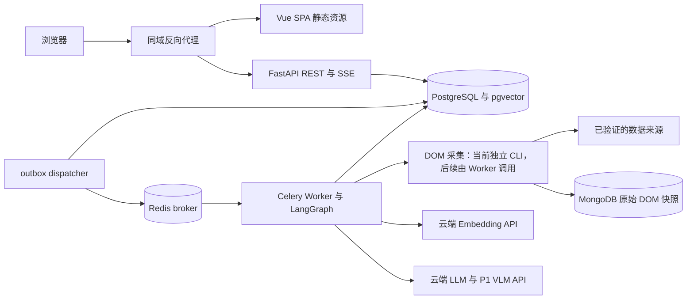

# InsightX 架构与技术选型

| 项目 | 说明 |
| --- | --- |
| 版本 | V1.2，2026-09-14，独立 DOM 爬虫闭环同步 |
| 状态 | **已有前端脚手架、FastAPI 基础入口、独立单 URL DOM 爬虫与 `infra/` 单机容器基座**；数据库/Redis 应用接入、迁移、Worker 集成、业务 API/SSE、模型接入与 CI 仍未实现 |
| 需求依据 | 根目录 [PRD.md](../PRD.md) |
| 决策依据 | [获批 R1 计划](plans/2026-09-12-monorepo-architecture-selection/plan.md) |
| 文档职责 | 定义 monorepo、选型、模块/运行边界与验证门禁；不代替实施计划或运行测试 |

## 1. 架构结论与业务边界

采用 **轻量异构 monorepo + 模块化单体 + 独立任务 Worker**。前后端分别构建，只通过 HTTP（REST + SSE）通信；API、Worker 和任务派发器共用一个 Python 业务包，不拆成微服务。

**LLM、VLM、Embedding 全部使用云端 API。** 开发机与项目服务器不部署模型权重、GPU/CUDA 推理环境或本地推理服务；项目侧负责数据清洗、CPU 聚类、编排、证据校验与存储。前端不能持有模型密钥或直连供应商。

- **P0**：Amazon US、单品类、已验证 ASIN/时间窗；评论采集 → 云端向量 → CPU 聚类 → 云端双栏建议 → 基础证据报告与实时看板。
- **P1**：云端视觉取证、确定性财务否决、图片及深度证据反查。
- **P2**：时间切片回测、TikTok/Temu 映射、供应链信号；不同时开工。
- 证据、租户隔离与真实状态优先于大规模性能优化。云端服务可用性、数据权限、预算、部署区域等须经 M0 验证，不假定账户已开通。

目录树同时展示当前文件和后续目标；未在 README 或对应结果记录中标记落地的组件、接口与测试仍不是当前能力。当前已落地的采集能力仅限独立单 URL DOM 爬虫；它不等于完整评论采集、Worker、LangGraph 或业务 API 已实现。

## 2. Monorepo 结构与依赖边界

```text
ai-plus/
├── PRD.md
├── AGENTS.md
├── README.md
├── frontend/
│   ├── package.json                # Vue 3 + Vite + TypeScript；Bun + bun.lock
│   ├── src/
│   │   ├── app/                    # 启动、路由、全局 provider
│   │   ├── features/               # tasks、insights、proposals、evidence
│   │   ├── components/             # 已出现真实复用需求的组件
│   │   └── api/generated/          # 后端契约生成的 TS 客户端
│   └── e2e/                        # Playwright 前后端闭环
├── backend/
│   ├── pyproject.toml
│   ├── uv.lock
│   ├── README.md
│   ├── src/insightx/
│   │   ├── main.py                 # FastAPI 应用工厂与模块级 app
│   │   ├── api/                    # 当前基础路由；认证、DTO、SSE 待实现
│   │   ├── crawler/                # 单 URL DOM 爬虫、JSON 与 MongoDB 持久化
│   │   ├── modules/                # tasks/reviews/analysis/reports
│   │   ├── workflows/              # LangGraph 图与节点
│   │   ├── integrations/           # 数据供应方与云端模型 API
│   │   ├── db/                     # 会话与数据库基础定义
│   │   ├── worker.py               # Celery 消费入口
│   │   └── dispatcher.py           # 事务 outbox 派发入口
│   ├── migrations/                 # Alembic
│   └── tests/                      # 单测、PG 集成、质量评测
├── contracts/
│   ├── openapi.json                # 从后端导出的契约快照
│   └── task-events.schema.json     # 从后端事件 DTO 导出的 schema
├── infra/                          # 当前单机容器部署基座
│   ├── compose.yaml                # db/redis/api/web 四服务
│   ├── backend.Dockerfile
│   ├── frontend.Dockerfile
│   └── nginx.conf                  # SPA fallback 与 /api 同域代理
├── .github/workflows/              # 前端、后端、契约、集成检查
└── docs/
    ├── architecture.md
    └── plans/                      # 每任务 plan.md 与 result.md
```

### 2.1 工具与锁文件

- 前端使用 Bun，维护 `frontend/bun.lock`；后端使用 uv，维护 `backend/uv.lock`。锁文件随代码评审，CI 使用冻结安装，不混入 npm/pnpm 的第二份锁文件。[S4, S5]
- 单仓库不要求一个跨语言包管理器。当前只有一个 JS 应用、一个 Python 包，先不引入 Bun/uv workspace、Turborepo、Nx 或空的 `packages/shared`。
- Bun/pnpm workspace 可以在出现真实共享 JS 包后评估；uv workspace 共享依赖解析与锁文件，只有多个 Python 包确实适合共享环境时才使用。[S4–S6]
- 不为 Python 项目造一份伪 `package.json`，不以目录数量判断架构成熟度。根级协作由 Git、契约和集成检查完成。

### 2.2 代码所有权

| 边界 | 负责 | 不负责 |
| --- | --- | --- |
| 前端 features | 页面、表单、交互、查询与展示状态 | 重算业务裁决、直连数据库或云模型 |
| 后端 api | HTTP/DTO、身份与租户校验、SSE 传输 | 在请求内执行长时间采集/模型分析 |
| 后端 modules | 任务、评论快照、分析结果、报告业务规则 | 绑定某个前端组件或队列内部结构 |
| workflows | 节点、条件分支、恢复时的业务编排 | 代替任务队列或成为唯一业务数据源 |
| integrations | 选定数据/云模型供应商的最小接入 | 通用插件平台、多厂商自动路由系统 |
| contracts | 从后端生成的语言无关传输契约 | 第二份手写事实源、共享跨语言业务源码 |

API、Worker、dispatcher 共用业务包、数据库模型与发布版本。这里的“模型”指数据库/DTO 定义，不是本地部署的 AI 权重。按业务模块组织，但不预建层层空抽象或通用 Repository 框架。

## 3. 技术选型

### 3.1 前端

| 项目 | 决策 | 理由与限制 |
| --- | --- | --- |
| 应用 | Vue 3 + TypeScript strict + Vite | 保留既有 Vue 方向；Vue 官方推荐 create-vue/Vite。工作台没有 SEO/SSR 要求，不引入 Nuxt/Next，也不为使用 FastAPI 模板而切 React。[S1, S7] |
| 工具运行时 | Node.js 24 LTS；Bun 管理依赖 | Node LTS 作为构建工具兼容基线；不要求所有工具切换 Bun runtime，实际补丁版本在初始化验证后锁定。[S4, S21] |
| 路由 | Vue Router | 页面及任务/报告地址导航 |
| 服务端状态 | TanStack Vue Query | 任务、报告、证据的查询、缓存和失效；查询键纳入已授权租户与业务参数。[S2] |
| 客户端状态 | Pinia；局部表单使用组件状态 | Pinia 仅管理跨页 UI 状态，不复制 Query cache 中的任务/报告数据。[S2] |
| 组件与样式 | shadcn-vue（Reka UI + Tailwind CSS v4）+ CSS 变量主题 | 组件源码经 CLI 复制进项目、归项目所有；浅色主题，品牌视觉经 CSS 变量令牌实现；不叠加第二套组件库。2026-09-13 经用户指令决策，替代原 Element Plus 方案。[S3] |
| 图表 | ECharts，按使用模块导入 | 保留痛点柱状/雷达图；数据来自报告，未评估的财务数值不补为 0 |
| HTTP | Hey API 生成 TypeScript 客户端，使用 Fetch | 由后端 OpenAPI 生成，生成文件不手改；SSE 单独按事件契约接入。[S7] |
| 验证 | vue-tsc、ESLint、Vitest + Vue Test Utils、Playwright | Vite 转译不代替类型检查，组件测试不代替真实浏览器集成测试。[S1, S20] |

shadcn-vue 组件源码入库、可定制，是当前设计自由度与交付效率的取舍，不是对所有 UI 风格和性能场景的普遍最优判断。

### 3.2 后端、任务与存储

| 项目 | 决策 | 理由与限制 |
| --- | --- | --- |
| HTTP 与配置 | Python 3.12、uv、FastAPI、Pydantic 2 / settings | HTTP/校验与 Python 分析生态；具体版本组合需要验证 |
| 数据库 | PostgreSQL 18 候选基线 + pgvector | 任务、评论、报告、证据和事件的业务事实源，也承载向量；镜像/扩展组合尚未实际运行验证。[S12] |
| 原始采集快照 | Playwright Chromium + MongoDB（`dom_snapshots`） | 已实现独立单 URL CLI：DOM JSON 原子写入本地文件，并将不可变原始 DOM/采集元数据写入 MongoDB；MongoDB 不是第二业务事实源 |
| 数据访问 | SQLAlchemy 2 + psycopg 3，同步会话起步 | 常规数据库路由使用 `def`；SSE 异步循环将短查询交给线程池。会话在访问单元内创建/关闭，不能并发共享。[S8] |
| 迁移 | Alembic | 自动生成的是待审候选迁移，必须人工核对并用真实 PostgreSQL 测试。[S9] |
| 队列 | Celery 5 系列 + Redis broker | 长任务离开 HTTP 请求进程；重投、超时、确认与重复消费必须显式设计。[S7, S10] |
| 工作流 | LangGraph + PostgreSQL checkpointer | 管节点、分支与持久恢复；不代替 Celery、业务报告或事件记录。[S11] |
| 模型 | 云端 LLM/VLM 与独立 Embedding API | Worker 仅调用供应商，不加载 AI 权重；细节见第 6 节 |
| 聚类 | scikit-learn，CPU 执行 | 消费云端向量，不是本地大模型推理 |
| 验证 | pytest、Ruff、mypy | 数据库集成、恢复与租户测试使用真实 PostgreSQL，不用 SQLite 代替 |
| 多模态资产 | P1 使用 S3 兼容对象存储 | P0 结构化文本与业务快照存 PostgreSQL，原始 DOM JSON 存 MongoDB 和本地文件副本；不提前部署 MinIO，不把图片内容放进 checkpoint |

网络采集、云模型调用与等待期间不保持数据库事务；SSE 连接不独占长期数据库会话。全面异步化由连接量与压测决定，不因使用 FastAPI 就假定同步库不会阻塞。

## 4. 运行拓扑与任务可靠性



拓扑展示目标职责，不表示图中组件已经全部部署。当前 Compose 基座只落地 Web、API、DB、Redis 四个容器；API 尚未连接 DB/Redis，Dispatcher、Celery Worker 与 LangGraph 均未部署。后端另已落地独立单 URL DOM 爬虫 CLI，可写本地 JSON 与 MongoDB，但尚未接入 Worker。API、Worker、dispatcher 属于同一个模块化后端，而不是三个独立业务服务。

### 4.1 提交、派发与执行

1. `POST /api/v1/tasks` 为拟定任务创建资源；提交 1–10 个 ASIN、站点、时间窗与幂等键。API 从已认证身份核验租户，不信任客户端自报的授权信息。
2. 在一个 PostgreSQL 事务中持久化 task、task_items 与 outbox，再返回 `202 + task_id`。提交成功不代表模型分析已完成。
3. dispatcher 派发 outbox 到 Celery。数据库与消息 broker 的双写通过 outbox 衔接；发送后崩溃可能造成重发，因此仍必须幂等消费。[S17]
4. Worker 按单 ASIN 工作单元驱动 LangGraph。尝试编号、执行所有权、心跳、超时与结果条件更新防止重复执行或旧尝试覆盖新结果。
5. 采集节点使用 Playwright 获取原始 DOM，将不可变 DOM JSON 快照及采集元数据写入 MongoDB；后续结构化评论、来源与业务输入引用 PostgreSQL 中的业务记录，不使用 MongoDB 替代业务事实源。
6. 节点结果、业务报告和有序事件持久化到 PostgreSQL；checkpointer 保存图恢复状态。checkpoint 与业务写入并非天然跨系统原子事务，节点重放必须能识别已完成的副作用。[S11]
7. 任务取消通过 REST 显式请求，Worker 在节点边界检查；关闭 SSE 或浏览器窗口不是取消。

### 4.2 三类状态不能混用

| 状态维度 | 含义 |
| --- | --- |
| 任务/工作单元生命周期 | 排队、执行、完成、失败或取消；批次必须保留每个 ASIN 的实际结果，不能用批次完成掩盖部分失败 |
| 报告数据质量 | 样本是否充足、是否部分缺失、是否无有效数据；无数据时不生成痛点或建议 |
| 财务裁决 | `NOT_EVALUATED` / `PASSED` / `VETOED`；P0 和输入不足时为 `NOT_EVALUATED`，不能从任务完成推出财务通过 |

图节点只显示真实执行/跳过/失败情况，不强制固定七步或伪进度条。缓存复用、无数据和供应商失败也必须对用户有明确说明。

### 4.3 恢复与幂等边界

- PostgreSQL 是任务、评论、报告、证据和事件的事实源；Redis 消息、Celery 结果或 MongoDB 原始 DOM 快照均不能替代业务表。
- 每次爬虫成功生成 UUID `snapshot_id`；MongoDB 文档 `_id` 与 `snapshot_id` 相同，`dom_sha256` 只对规范化 DOM JSON 计算。快照和本地 JSON 文件视为不可变采集产物。
- PostgreSQL 与 MongoDB 之间没有分布式事务；同一快照 ID、DOM 哈希和后续幂等消费用于对账，不宣称跨库 exactly-once。
- 使用稳定、与授权工作单元绑定的 graph thread 标识恢复 checkpoint；恢复入口不接受未经授权的任意 thread_id。[S11]
- Redis 持久化、消息确认、可见性超时、任务限时和失效恢复策略必须联合验证。迟确认不自动带来 exactly-once，某些 Worker 终止方式还涉及额外配置。[S10]
- 外部调用与写入需要幂等键/既有结果检查；SDK、节点和队列重试共享预算，避免成倍放大云端费用。
- 必测窗口：数据库提交后未发消息、消息发送后未标记、broker 暂不可用、Worker 中止、节点执行后未写完 checkpoint、重复消息、取消与恢复竞争。不能仅凭“用了 Celery/LangGraph”宣称零丢失或自动恢复已完成。

## 5. API、SSE 与生成契约

### 5.1 契约单一来源

后端 Pydantic DTO → 导出 `contracts/openapi.json` 与 `contracts/task-events.schema.json` → 生成 `frontend/src/api/generated/` 的 TypeScript 客户端。正式接口以以后生成的契约为准，本文件不假装提供现有接口清单。[S7]

- 业务表结构与传输 DTO 分开，避免把内部字段直接暴露给前端。
- 生成文件随变更评审，不手改；CI 重生成并检查漂移。后端 DTO 变化必须触发前端消费者检查。
- SSE 的事件数据也由后端 DTO 导出 schema，不能只给一个未定义结构的字符串。普通 JSON 客户端生成不代替 SSE 实现。

### 5.2 SSE 行为

- 事件包含版本、事件 ID、类型、任务/工作单元、时间和 payload。ID 应支持同一任务内排序、去重和游标回放；具体字段以事件 DTO 固化。
- 使用 EventSource 监听 `text/event-stream`。浏览器可根据事件 `id` 记录位置并重连，但**历史回放必须由后端实现**。[S16]
- 后端读取持久事件，支持 `Last-Event-ID` 对应位置后的回放；页面首次恢复任务也需通过显式游标/查询机制衔接，不能假定新建 EventSource 会记住上次页面的位置。
- 保留心跳、事件保留范围与游标失效提示；客户端去重后更新 Query cache，必要时重新查询最终报告。终态/页面卸载关闭连接，避免每张卡片独立常驻连接。
- Redis Pub/Sub 可以以后用作通知优化，但不是 P0 唯一事件源。长连接不持有数据库事务，反向代理缓冲和空闲超时在真实联调中验证。

## 6. 云端模型、聚类与证据

### 6.1 云端选型与准入

| 能力 | 目标选择 | 必须验证 |
| --- | --- | --- |
| P0 文本标签/建议 | Anthropic Claude 云端 API 的 Active 模型 | 账户与区域、准确 model_id、结构化输出、多语言质量、用量/费用；不固定旧型号 |
| P1 视觉取证 | 经验证支持视觉输入的云端 Claude 模型 | 图像输入、缩放/坐标映射、缺陷证据、费用与降级；不能仅凭文字模型可用就认为视觉已验证 |
| P0 Embedding | 云端 BGE-M3 Dense，1024 维基线；优先验证 SiliconFlow `BAAI/bge-m3` | 账户可用性、实际维度、批量顺序、输入限制、质量、价格与数据条款；候选不等于已开通 |

Anthropic 官方说明其不提供自有 Embedding 模型，故独立选择 Embedding 供应方；不能假定 Claude 的密钥或 API 自动具备向量能力。SiliconFlow 官方文档列有 BGE-M3，但本项目尚未实调用。[S14, S15, S22, S23]

### 6.2 接入、安全与费用边界

- 仅后端 Worker 通过供应商支持的 SDK/HTTP API 调用，密钥从服务端受控配置读取；不让前端保存密钥，不把供应商返回原样当成业务结果。
- 不为统一接口强行把不同协议当成同一个 Chat API；只实现所选供应商的最小接入，不新增通用网关、自动多模型路由或跨厂商静默故障切换。
- 不安装本地推理所用 PyTorch、Transformers、FlagEmbedding；不部署 Ollama、vLLM 或 GPU/CUDA 服务，不下载模型权重作为开发和故障兜底步骤。CPU 清洗/聚类不受此限制。
- 每次调用有超时，任务有总尝试/时间/费用预算；按供应商输入上限、批量和并发限制发送。鉴权失败、模型不可用、额度用尽与暂时限流要区别处理。
- 只重试可恢复错误；存在 `Retry-After` 时遵守，SDK 自动重试纳入统一预算。不能对所有 429 无限重试，额度不足可能需要停止而不是退避重试。[S24]
- 记录可获取的供应商请求 ID、实际用量、耗时与模型标识。费用按可核验的计费口径估算并标注，不把 token 数或估算额冒充真实账单。
- 云端不可用时，只能复用合法、同租户且匹配快照/模型配置的已验证缓存，或显式失败/标记受影响部分未完成；不生成假向量，不切回本地推理。

### 6.3 数据与向量空间

- 数据源先在 M0 验证授权、child ASIN、分页、时间覆盖、字段与费用。采集数量按实际保存，并解释缺失；200–500 条是样本目标，不是补齐配额。
- 保存原始评论、可追踪片段与快照；每个处理结果绑定租户、来源/采集时间、内容哈希和输入快照。样本中的差评占比不冒充商品总体差评率。
- 向量记录供应商、准确 model_id、实际维度、应用侧 embedding 版本及可获取的供应商版本信息。模型、维度或预处理不兼容时不混入同一向量空间；同名模型不同托管实现也不预设等价。
- 更换供应商/模型须单独评审质量回归、向量重建和索引范围；缓存键包含租户、输入哈希与 embedding 配置，不能只按 ASIN 命中。
- pgvector 初始采用精确检索与业务过滤索引；HNSW 是需要规模、召回与租户过滤测试证明收益的后续优化，不是聚类算法或无条件前置。近似索引后过滤可能影响返回数量。[S12]

### 6.4 聚类、建议与溯源

1. 对限定 ASIN/快照的评论片段调用云端 Embedding，CPU Worker 执行 scikit-learn 凝聚层次聚类，基线为 cosine + average linkage。阈值通过小样评测选定，不虚构“最佳阈值”。[S13]
2. 控制每个工作单元的样本范围，避免无限扩大距离矩阵。小簇标记低支持；该基线不被描述为自动识别噪声。HDBSCAN 仅为对照候选，不同时上线两套算法。
3. 云端 LLM 根据聚类证据生成标签和“产品本体 / 包装履约”两栏建议。最多展示 5 类有证据的痛点，不足不补造；无有效评论不生成建议。
4. 每条结论检查引用 ID 属于同租户、同任务快照，并核对内容是否支持结论。结构化 JSON 通过不等于语义可靠；不能凭空生成模具尺寸、成本或收益。
5. 报告记录引用、prompt/模型版本、用量与验证结果；P0 支持文本反查，P1 再扩展图片、筛选和高亮，不为 P0 显示不存在的图片证据。
6. P1 视觉定位与物理归因属于待复核模型输出，处理坐标缩放并抽样核验，不当作物理测量或因果证明。[S15]
7. P1 财务裁决由确定性、版本化公式和有来源的输入/费率完成；LLM 只解释或提出替代建议。缺失输入时为 `NOT_EVALUATED`，不得默认通过。
8. P2 回测区分时间截断的输入数据与模型可能已有的知识；报告局限，不声称排除了所有未来知识泄漏或证明因果关系。

## 7. 鉴权、租户与数据合规

- 前后端分别构建，部署优先使用同域反向代理分流 SPA 与 `/api`；开发代理沿用同一边界。同域不是共用代码进程，也不破坏 HTTP 分离。
- 使用服务端会话与 HttpOnly/Secure/SameSite cookie；浏览器不持久化 bearer token，不把长期 token 放入 SSE URL。写操作执行 CSRF 防护，不能认为 HttpOnly 自动防止 CSRF。[S18]
- P0 只做受控账号、登录/退出及最小会话，不扩大到公开注册、支付或完整身份平台；公开多租户运行前必须完成隔离验证。
- 租户上下文来自服务器核验的身份与成员关系。客户端 tenant_id 只能作为选择器；REST、SSE 回放、缓存、证据访问和 Worker 全链路验证授权，前端隐藏按钮不是权限控制。[S18]
- TLS、基础设施存储与备份加密、最小权限和密钥管理是验收对象；实际部署方案需给出证据，不能只写“强加密”。
- 云端模型上传最小必要输入，移除非必要个人信息，不默认上传完整企业财务资料或工程图纸。数据授权、服务区域、保留/训练条款与跨境要求随供应方核对；未经核验不承诺零保留或不会用于训练。
- 普通日志不记录密钥、完整会话、完整敏感原文或不必要的模型输入/输出。

## 8. 部署、测试与性能验证

### 8.1 部署目标

- 当前 `infra/compose.yaml` 提供 `db`、`redis`、`api`、`web` 四个单机服务：数据库和 Redis 只在 Compose 网络内访问，API 只在内部暴露 `8000`，Web 通过 Nginx 提供 SPA fallback 并把 `/api/` 代理到 API。`/api/v1/health` 仍返回 `degraded`，因为应用尚未实现数据库和 Redis 探针；四个容器健康不等于业务链路 ready。
- Docker Compose 的 Linux 容器作为初始联调/部署基线；Celery 官方不支持 Windows 原生，Windows 开发使用 Docker Desktop/WSL2 的 Linux Worker。[S10]
- 目标部署中 API、dispatcher、Worker 使用同版业务包，运行职责分开；前端独立静态构建。数据库和 broker 的存储、权限、备份和恢复另行验证。
- Compose 的启动顺序不代表 ready，依赖健康检查、迁移完成与应用就绪分别处理；迁移不由每个 API/Worker 实例并发执行。[S9, S19]
- 先提供结构化日志与 request_id/task_id/item_id、节点耗时、重试和模型用量关联。不默认安装整套可观测平台。
- 单机 Compose 不提供已验证高可用保证。容器镜像、Redis 等依赖的实际版本、许可证和托管条件在初始化/部署任务中核对。

### 8.2 检查分层

| 层次 | 后续必须形成的证据 |
| --- | --- |
| 前端 | lint、vue-tsc、Vitest/组件测试、生产构建 |
| 后端 | Ruff、mypy、pytest；业务与供应商错误分支测试 |
| 数据库 | 真实 PostgreSQL/pgvector 的迁移、事务、幂等、并发和租户隔离测试 |
| 契约 | 重生成 OpenAPI/事件 schema/客户端无漂移；后端 DTO 改动触发前端消费者验证 |
| 端到端 | Playwright 覆盖创建、进度、报告、证据、无数据、部分失败、取消、恢复、SSE 回放和越权 |
| 云端与质量 | 经批准、有预算的真实模型/数据调用；单独验证维度、顺序、输入限制、账户/区域、质量、限流/额度与用量 |

普通 CI 使用明确标识的云端响应 fixture/mock，不下载模型或无预算调用收费 API；这些测试不能代替真实模型质量验证。[S20]

### 8.3 性能口径

沿用 PRD 的基础查询 P95 200ms、单 ASIN 500 条评论任务 30–60 秒、10 万向量 Top 50 检索 50ms、SSE 300ms 和可用性 99.5% 的**工程目标**，不是当前实现成绩或无条件 SLA。

- 查询时延排除云端推理，只测明确定义的基础查询；说明数据库规模、并发与部署资源。
- P0 任务总耗时从创建成功到报告可取，分解排队、采集、Embedding、聚类、LLM 和持久化；包含外部等待，并区分缓存命中/未命中。P1 图像与财务路径另外评估。
- 向量目标注明模型/维度、过滤条件、索引、返回数与召回；不把云端生成向量的时间算作数据库检索。
- SSE 对同一事件 ID 测量持久事件提交至前端呈现，注明连接数、网络和时钟测量方法；节点执行/写入耗时另行记录。
- 可用性须明确统计周期、服务探针、依赖故障和降级口径。M0/M1 形成基线后再确认承诺值；若需调整目标，提出修订并审核，不能在实现中悄悄放宽。

## 9. 演进顺序、取舍与非目标

| 阶段 | 进入/退出门禁 |
| --- | --- |
| M0-A | 授权样本试采；云端 LLM/Embedding 账户、质量、维度和成本验证；P1 VLM 另列验证状态，不冒充 P0 前置完成 |
| M1 | 初始化 frontend/backend、锁定兼容版本、数据库与迁移、契约生成、最小前端原型与健康检查 |
| M2 | 一个真实 ASIN 文本闭环，再扩展至批次；报告引用校验、持久事件与图恢复 |
| M3 | 前后端真实联调、故障恢复、取消、SSE 回放、租户隔离与 P0 验收 |
| M4/M5 | P1 视觉/财务、P2 回测/多平台/供应链按各自门禁演进 |
| M6 | 部署、恢复与演示验证，形成真实结果记录，而非仅编写命令 |

- **保留 Vue，而非直接套 React 模板**：借鉴 FastAPI 官方的契约生成和测试实践，不为模板改变产品栈。[S7]
- **Bun + uv，而非先上大型构建平台**：当前两个语言项目足够独立；等共享包或构建瓶颈真实出现再评估 workspace/缓存。[S4–S6]
- **shadcn-vue（Tailwind CSS v4 + Reka UI），而非 Element Plus 加自绘主题**：组件源码入库、CSS 变量令牌统一浅色主题；2026-09-13 经用户指令决策；不叠加第二套组件库。
- **Celery/Redis + outbox，而非在 HTTP 请求中跑任务**：承担与可靠性目标直接相关的成本。PostgreSQL 队列是备选，但不在未经集成验证时更换，也不自建通用队列。[S7, S10, S17]
- **pgvector，而非独立向量库**：先统一证据与向量事务边界；精确检索起步，规模优化有证据后再做。[S12]
- **云端 API，而非本地推理**：这是用户明确要求；降低项目侧模型部署负担，但仍存在账户/区域、费用、限流、数据合规及网络依赖风险。

不引入微服务、Kubernetes、Kafka、SSR、GPU 集群、默认多模型网关、付费后台模板或额外产品角色。所有代码、配置和外部调用的后续实施仍遵循 [AGENTS.md](../AGENTS.md) 的计划、审批、验证与结果流程。

## 10. 官方参考与证据限制

资料检索日期：2026-09-12。以下资料支持工具能力与风险边界；本项目的组合选择属于工程判断，不代表官方对 InsightX 的背书。

| 编号 | 来源 | 用途 |
| --- | --- | --- |
| S1 | [Vue Tooling](https://vuejs.org/guide/scaling-up/tooling)、[TypeScript](https://vuejs.org/guide/typescript/overview) | Vite 工具链与类型检查 |
| S2 | [TanStack Query 与 Pinia 的职责](https://tanstack.com/query/latest/docs/framework/vue/guides/does-this-replace-client-state) | 服务端/客户端状态分离 |
| S3 | [shadcn/vue 文档](https://www.shadcn-vue.com/docs)、[Sidebar](https://www.shadcn-vue.com/docs/components/sidebar)、[Theming](https://www.shadcn-vue.com/docs/theming) | 组件、外壳与 CSS 变量主题 |
| S4 | [Bun Workspaces](https://bun.sh/docs/pm/workspaces)、[Lockfile](https://bun.sh/docs/pm/lockfile) | 包管理与锁文件 |
| S5 | [uv Workspaces](https://docs.astral.sh/uv/concepts/projects/workspaces/) | Python 工作区取舍 |
| S6 | [Turborepo 结构](https://turborepo.com/docs/crafting-your-repository/structuring-a-repository)、[pnpm Workspace](https://pnpm.io/workspaces) | 备选 monorepo 工具 |
| S7 | [FastAPI Background Tasks](https://fastapi.tiangolo.com/tutorial/background-tasks/)、[Generating SDKs](https://fastapi.tiangolo.com/advanced/generate-clients/)、[Full Stack Template](https://fastapi.tiangolo.com/project-generation/) | 长任务外置与契约生成 |
| S8 | [FastAPI async/await](https://fastapi.tiangolo.com/async/)、[SQLAlchemy Session Basics](https://docs.sqlalchemy.org/en/20/orm/session_basics.html) | 阻塞边界与会话并发 |
| S9 | [Alembic Autogenerate](https://alembic.sqlalchemy.org/en/latest/autogenerate.html) | 迁移审核 |
| S10 | [Celery Tasks](https://docs.celeryq.dev/en/stable/userguide/tasks.html)、[Redis broker](https://docs.celeryq.dev/en/stable/getting-started/backends-and-brokers/redis.html)、[Windows FAQ](https://docs.celeryq.dev/en/stable/faq.html) | 重试、确认、平台支持 |
| S11 | [LangGraph Persistence](https://docs.langchain.com/oss/python/langgraph/persistence)、[Checkpointers](https://docs.langchain.com/oss/python/langgraph/checkpointers)、[Functional API](https://docs.langchain.com/oss/python/langgraph/functional-api) | 图恢复与副作用 |
| S12 | [pgvector 官方 README](https://github.com/pgvector/pgvector/blob/master/README.md) | 精确/近似检索及过滤 |
| S13 | [AgglomerativeClustering](https://scikit-learn.org/stable/modules/generated/sklearn.cluster.AgglomerativeClustering.html)、[HDBSCAN](https://scikit-learn.org/stable/modules/generated/sklearn.cluster.HDBSCAN.html) | 聚类基线及对照 |
| S14 | [BAAI/bge-m3 模型卡](https://huggingface.co/BAAI/bge-m3) | 多语言向量基线 |
| S15 | [Claude 生命周期](https://platform.claude.com/docs/en/about-claude/model-deprecations)、[Vision](https://platform.claude.com/docs/en/build-with-claude/vision)、[Vision Coordinates](https://platform.claude.com/docs/en/build-with-claude/vision-coordinates) | 模型可用性与视觉边界 |
| S16 | [MDN SSE](https://developer.mozilla.org/en-US/docs/Web/API/Server-sent_events/Using_server-sent_events)、[EventSource 构造器](https://developer.mozilla.org/en-US/docs/Web/API/EventSource/EventSource) | 重连、事件与凭证 |
| S17 | [AWS Transactional Outbox](https://docs.aws.amazon.com/prescriptive-guidance/latest/cloud-design-patterns/transactional-outbox.html) | 数据库与消息双写 |
| S18 | [OWASP Session](https://cheatsheetseries.owasp.org/cheatsheets/Session_Management_Cheat_Sheet.html)、[CSRF](https://cheatsheetseries.owasp.org/cheatsheets/Cross-Site_Request_Forgery_Prevention_Cheat_Sheet.html)、[Multi Tenant](https://cheatsheetseries.owasp.org/cheatsheets/Multi_Tenant_Security_Cheat_Sheet.html) | 会话与租户隔离 |
| S19 | [Docker Compose Startup Order](https://docs.docker.com/compose/how-tos/startup-order/) | 服务就绪与依赖 |
| S20 | [Vue Testing](https://vuejs.org/guide/scaling-up/testing)、[Playwright CI](https://playwright.dev/docs/ci) | 分层测试 |
| S21 | [Node.js 24 LTS 公告](https://nodejs.org/en/blog/release/v24.11.0) | 工具运行时基线 |
| S22 | [SiliconFlow Embeddings API](https://docs.siliconflow.cn/en/api-reference/embeddings/create-embeddings)、[Embedding 输入说明](https://docs.siliconflow.cn/docs/api/embeddings-post) | 云端 BGE-M3 候选 |
| S23 | [Claude Embeddings](https://platform.claude.com/docs/en/build-with-claude/embeddings) | 独立 Embedding 供应方 |
| S24 | [Claude API Errors](https://platform.claude.com/docs/en/api/errors)、[Rate Limits](https://platform.claude.com/docs/en/api/rate-limits) | 错误分类与预算/重试 |

**证据限制：** 本次获得的是官方来源的检索摘要/片段。页面正文直连因本机 fake-IP/TUN 的 SSRF 安全检查受阻，未声称全文抓取成功，也未修改安全配置绕过限制；一次独立来源核验返回 `missing-evidence`，没有作为通过依据。没有做依赖安装、真实数据库/模型/采集调用、费用账单核对或压测；版本、账户与质量/性能准入仍是后续门禁。
