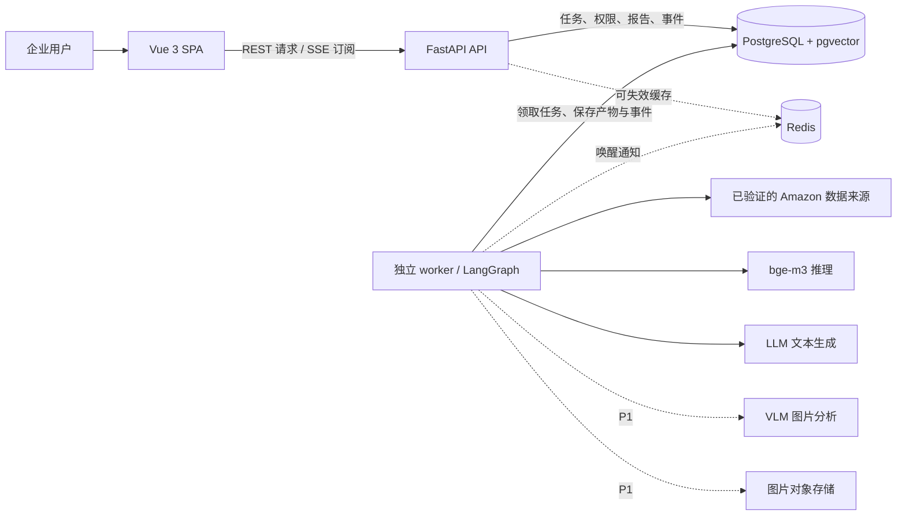
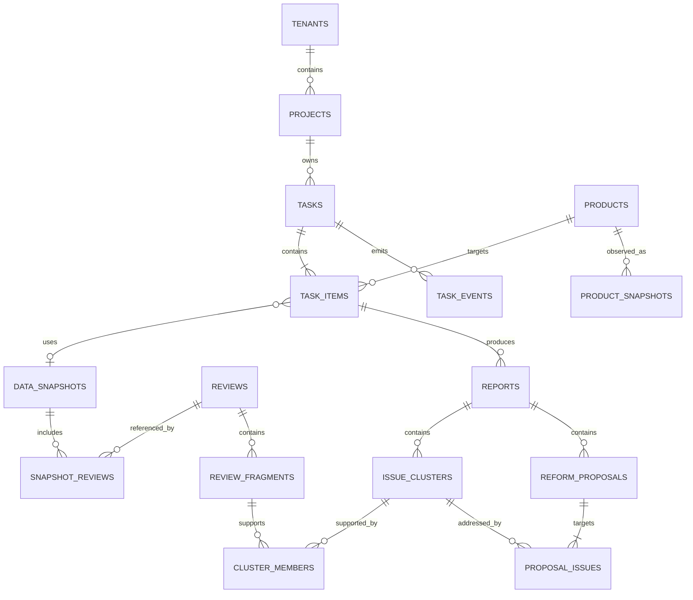
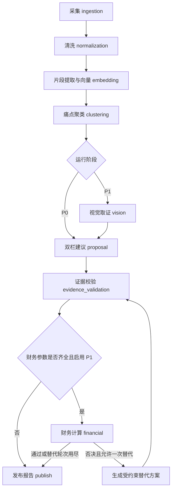

# InsightX 系统技术方案

> 版本：V0.1 设计草案 · 2026-09-10  
> 需求基线：[PRD V1.1](PRD.md)。用户已确认：以 PRD 为目标、现有前端为可复用原型，技术版本在实施前验证。  
> 本文描述目标设计，不表示功能已经实现；接口配套见 [REST / SSE 契约](api.md)。

## 1. 现状、差异与设计边界

### 1.1 仓库核查结果

| 内容 | 当前事实与依据 | 设计处理 |
| --- | --- | --- |
| 前端 | [App.vue](../frontend/src/App.vue) 使用 `INITIAL_TASKS` 和 `MOCK_*`，通过本地 Tab 切换页面 | 复用组件和视觉结构，逐步接入真实任务数据 |
| 任务流 | [AgentWorkflowTab.vue](../frontend/src/components/AgentWorkflowTab.vue) 通过 `setInterval` 模拟执行 | 改为后端任务快照和 SSE 驱动 |
| 证据 | [EvidenceDrawer.vue](../frontend/src/components/EvidenceDrawer.vue) 使用固定评论列表 | 按任务、痛点或建议的真实关联查询 |
| 财务 | [FinancialVetoTab.vue](../frontend/src/components/FinancialVetoTab.vue) 在浏览器计算，使用预置参数与阈值 | 现有结果仅属原型；P1 建立后端版本化计算 |
| 身份 | [AuthModal.vue](../frontend/src/components/AuthModal.vue) 写入 `jwt_mock_*`；App 从 localStorage 恢复用户 | 尚无真实鉴权，不能作为租户隔离依据 |
| 后端 | 仓库文件清单中没有 `backend/` | 后续新建，不能按 README 宣称已运行 |
| 文档 | 本次设计前 `docs/` 仅有 PRD；API、技术方案和 README 中其他文档链接均未落地 | 本次新增本文与 API 草案；不补写无关申报材料 |
| 前端依赖 | [package.json](../frontend/package.json) 有 Vue、Vite、Tailwind、GSAP、vue-i18n；没有 Router、Pinia、ECharts | 保留现有状态组织；ECharts 在落实 P0 图表时引入 |
| 开发代理 | [vite.config.ts](../frontend/vite.config.ts) 未配置 README 所述 `/api` 代理 | 联调阶段补齐 |
| 基础设施 | [docker-compose.yml](../docker-compose.yml) 声明 pgvector/pg16、Redis 7 和缺失的 backend 构建目录 | PRD 的 PostgreSQL 18 / Redis 8 等版本待验证后统一，当前 Compose 不是完整部署产物 |
| 状态与范围 | [types/index.ts](../frontend/src/types/index.ts) 把 `vetoed` 放进任务状态，支持多个站点；PRD P0 限定 Amazon US | 任务状态与财务决议分离，P0 输入限制 US |

PRD 自身仍有未闭合的口径：P0 大盘要求 FBA 节省额，但财务在 P1；要求“7 步”动画，但 P0 不运行视觉、财务和回测；“改款潜力指数”和五维评分没有算法定义。本文建议展示未评估状态、按实际节点展示进度，不填充假数值。相应 PRD 文字调整仍待确认，本次不改 PRD。

### 1.2 系统的最小业务对象

以“一个企业内、一个品类、一个时间窗、1–10 个竞品的诊断任务”为业务入口。一个任务包含多个 ASIN 分项，每个分项独立产生采集结果、痛点与建议；大盘聚合已完成分项。P0 不把不同商品的痛点合并成一份工程方案。

主链路：**提交任务 → 获取可追溯数据快照 → 提取与聚类痛点 → 生成双栏建议 → 校验证据 → 查看报告**。

业务角色决定信息重点，P0 不据此新增审批流：选品负责人看样本和痛点；PM 看产品改款；供应链看包装改进；运营看竞品数据；老板看结论及限制。正式多人权限在接入阶段确定授权矩阵，产品中的“财务否决”不等于执行停产、采购或支付指令。

### 1.3 按阶段交付

| 阶段 | 纳入 | 本阶段不承诺 |
| --- | --- | --- |
| M0-A | 单品类 5–10 个 child ASIN 数据验证，候选模型调用、质量、耗时和费用验证 | 所有 ASIN 可采、任意时间窗完整、200–500 条必达 |
| P0 | Amazon US、1–10 个 ASIN、默认近六个月、文本清洗、bge-m3、Top 5 痛点、双栏建议、基础原文证据、任务大盘和 SSE | 视觉归因、FBA 测算、ROI 通过、实时价格告警、自动调价、工程文件导出 |
| P1 | 图片取证、证据筛选与高亮、版本化财务情景、受约束替代方案 | 仅凭照片确认材料牌号、公差、因果关系或认证通过 |
| P2 | 时间切片回测、跨平台候选匹配、外部供应链信号 | 没有历史可用数据时生成回测准确率 |

PRD 导航中的 Buy Box、分钟级告警、价格弹性、周报、PDF/Word/Excel 导出没有完整的优先级和验收口径。保留为后续需求入口，不自动加入 P0；导出格式也需统一后再实施。

## 2. 总体架构与模块职责

采用模块化单体后端，同一代码库提供 API 和独立 worker 两个进程。前后端只通过 HTTP 通信。P0 使用数据库持久任务队列，避免在还没有后端时同时引入 Celery 等额外调度依赖；README 的 Celery 是目标描述，不是已安装能力。



| 模块 | 输入与输出 | 职责边界 |
| --- | --- | --- |
| 身份与任务 API | 用户身份、任务输入 → 任务 ID / 快照 | 鉴权、租户范围、校验、幂等、查询；不在请求内跑模型 |
| 任务执行 | 持久任务 → 节点产物和执行事件 | 领取、续租、重试、取消、恢复、终态聚合 |
| 采集与标准化 | ASIN、站点、时间窗 → 商品快照、评论版本、采集覆盖报告 | 保存原始来源；不补造缺失数据 |
| 语义分析 | 有效评论 → 抱怨片段、向量、痛点与成员 | 归类、去重统计、严重度依据、未归类记录 |
| 建议生成 | 痛点及原声 → 本体 / 包装建议 | 生成具体行动、验证方法和引用；不代替工厂确认规格 |
| 证据与报告 | 校验后的关联 → 可读报告 | 校验引用范围、统计数量、发布不可变版本 |
| 财务计算（P1） | 用户参数、费率版本、方案增量 → 指标与否决理由 | 确定性计算，LLM 只解释与提出替代方案 |
| 演进模块（P2） | 历史快照、其他平台和外部信号 → 独立分析结果 | 不改变 P0 任务的历史结果 |

PostgreSQL 是任务状态、报告、证据和事件的事实来源。Redis 只做可重建的缓存/通知，丢失不应丢任务或让 SSE 无法恢复。worker 定期从数据库发现待运行任务，因此任务入库与外部消息发送之间不需要双写成功保证。

P0 从一个 worker、受限 ASIN 并发开始；bge-m3 只在推理端装载一次，不随每个 HTTP 请求重复加载。推理是同进程还是独立服务，由 M0-A 的硬件和压测决定。P1 才引入图片对象存储；不在 P0 提前搭完整图片平台。

## 3. 用户流程与页面设计

### 3.1 一次诊断

1. 在大盘创建任务：填写品类内的 ASIN 列表，选择时间窗；US 固定。标准 Amazon URL 可在输入层提取 ASIN，后端仍验证规范化值。
2. 校验 10 位字母数字编码、1–10 个去重后的 ASIN、合法日期和单品类范围。格式合法不代表商品存在；存在性和 child/parent 归属由数据来源验证。
3. 立即得到任务 ID，进入任务页；逐 ASIN 展示排队、当前节点、实际采集数量与限制。
4. 已完成的 ASIN 可先查看报告，其他分项继续执行。用户切换 ASIN 时，所有指标、图表、建议和抽屉统一切换上下文。
5. 点击痛点或改款建议，打开相应原始评论。关闭页面不取消后台任务，重新打开可恢复。
6. P1 可针对某个报告版本录入财务情景；计算结果引用该报告，编辑参数生成新情景版本，不改写旧结论。

### 3.2 页面与当前组件对应

| 页面 | 现有组件 | P0 展示与交互 | 后续扩展 |
| --- | --- | --- | --- |
| 决策大盘 | `DashboardTab.vue` | 任务列表、ASIN 选择、采样时间、样本平均星级、样本低星占比、痛点数、数据限制 | 企业级风险聚合、已计算的财务指标 |
| 执行详情 | `AgentWorkflowTab.vue` | 真实节点状态、已处理/总量、失败原因、重试、取消 | P1 节点及财务替代轮次 |
| 评论洞察 | `VocClusterTab.vue` | Top 5 痛点、频次、严重度、典型原声、样本说明 | 图片画廊和高级语言筛选 |
| 双栏决策 | `DualColumnProposalsTab.vue` | 左产品本体、右包装履约；行动、痛点引用、待验证项 | 成本、尺寸、周期和导出 |
| 证据抽屉 | `EvidenceDrawer.vue` | 按真实关联显示原文、来源、日期、星级 | 译文、高亮、图片、筛选 |
| 财务风控 | `FinancialVetoTab.vue` | 显示“本阶段未评估”，不执行原型计算冒充结论 | 参数表单、现金流、敏感度与否决说明 |

P0 继续使用现有 Tab 结构，不为接 API 顺手引入 Router / Pinia。需要链接恢复时，以 URL 查询参数记录 task/item/tab，不存敏感财务输入。后续确有独立页面导航需求再增加路由。

页面必须覆盖：首次无任务、排队、加载、部分结果、无有效评论、失败、取消、断线重连、报告可用。无证据时允许某一栏为空并说明原因；不为填满双栏生成无依据建议。样本少于五类时显示实际数量。

```text
任务与 ASIN 上下文                 [数据截至日期] [样本覆盖提示]
样本数 | 样本平均星级 | 样本低星占比 | 已识别痛点
节点进度与告警
痛点排行榜 / 频次图
产品本体建议                     包装履约建议
行动 + 对应痛点 + 待验证项         行动 + 对应痛点 + 待验证项
[查看原始证据]                    [查看原始证据]
```

所有统计明确分母。默认“低星”为 1–3 星，是本设计建议口径，与 PRD 的筛选范围一致，需在验收样本中固定。只抓到低星评论时，整体差评率与商品平均星级不可推断：显示 `null` 及原因；有全星级样本也只称样本指标，不外推市场总体。

“改款潜力指数”、潜在 ROI、退货率压降没有已确认算法或数据时显示未评估。P0 FBA 节省额为 `null`，财务状态为 `NOT_EVALUATED`。禁止将其显示为 0 美元或绿灯通过。

## 4. 数据设计

### 4.1 关联模型



以下是逻辑表设计，不是已存在的数据库迁移。P0 仅建闭环必需表；P1/P2 表在对应阶段创建。所有企业业务表携带 `tenant_id`，关联时同时约束租户及父级范围。

| 表 / 阶段 | 核心字段 | 约束与用途 |
| --- | --- | --- |
| `tenants`、`users`、`memberships` / P0 | 企业、真实身份、成员关系 | 服务端解析当前企业身份；不信任请求自报 tenant |
| `projects` / P0 | tenant、name、category、marketplace | P0 可预置一个品类项目，不另建项目管理平台 |
| `products` / P0 | tenant、platform、marketplace、asin、parent_asin | `(tenant, platform, marketplace, asin)` 唯一；不混同变体 |
| `product_snapshots` / P0 | product、observed_at、source、title、price、currency、BSR、尺寸重量及单位 | 价格与排名是采集时点值；缺失字段为 null |
| `tasks` / P0 | project、input、status、phase、idempotency_key、request_hash、cancel_requested_at、created_at | 同租户同幂等键唯一；输入不可变 |
| `task_items` / P0 | task、product、status、current_node、attempt、lease_owner、lease_until、lease_version、snapshot_id | `(task, product)` 唯一；逐 ASIN 恢复和失败隔离 |
| `data_snapshots` / P0 | product、product_snapshot_id、window_start/end、observed_at、source、source_query、cleaning_version、coverage、content_hash | 冻结任务所用数据与查询条件，不被后续采集覆盖 |
| `reviews` / P0 | product、source_review_id、content_hash、raw_text、rating、language、reviewed_at、observed_at、source_url | 原文按版本不可变；相同来源评论发生修改时新建版本 |
| `snapshot_reviews` / P0 | snapshot、review、included、exclusion_reason | 快照内同一来源评论最多选一个版本，保留被排除原因 |
| `review_fragments` / P0 | review、start/end、text、extraction_version、embedding、embedding_model_revision | 使用 `vector(1024)`；片段位置指向原文；长评多片段 |
| `reports` / P0 | item、version、snapshot_id、pipeline/model/prompt_versions、availability、limitations、published_at | 发布后不可变；新执行写新报告 |
| `issue_clusters` / P0 | report、name_zh/en、category、frequency、denominator、severity、severity_reason | 标准维度使用质量/功能/尺寸/配件/说明书/包装/其他，展示名可更细 |
| `cluster_members` / P0 | cluster、fragment、relevance | 同片段同簇唯一；频次按原评论去重，不按片段计数 |
| `reform_proposals` / P0 | report、column、title、action、expected_effect、verification_required、assumptions | column 为 `PRODUCT` / `PACKAGING`；未知成本与尺寸保留 null |
| `proposal_issues` / P0 | proposal、cluster | 多对多且必须同一报告；证据由关联簇成员导出并去重 |
| `task_events` / P0 | task、seq、type、item_id、attempt、occurred_at、payload | `(task, seq)` 唯一；状态与对应事件在同一事务提交 |
| `review_images`、`visual_evidences` / P1 | review、source_url、object_key、hash、观察、假设、bbox、模型版本 | 图片必须关联评论版本，不能拿图库图当买家证据 |
| `financial_scenarios`、`financial_results` / P1 | report_version、inputs、assumptions、fee_version、rule_version、result、veto_status | 输入与结论不可变；场景版本独立于任务终态 |
| 历史评估 / P2 | cutoff、输入快照、后验窗口、指标定义、结果 | 按实际回测指标设计表，不提前固化一个准确率字段 |

LangGraph 检查点作为内部执行存储，不替代业务表。官方文档说明 checkpointer 保存线程执行状态，内存实现不能跨进程重启保留；本设计采用持久检查点，线程标识由 item 与 attempt 组成。具体集成方式在选定版本后验证。[LangGraph 持久化文档](https://docs.langchain.com/oss/python/langgraph/persistence)

### 4.2 可追溯性与幂等

- 证据路径固定为：`proposal → proposal_issues → issue_cluster → cluster_members → fragment → review → source_url`。显示的证据数量必须等于这条路径按 review 去重后的实际结果。
- 评论原文、日期、来源、图片关联和译文分开保存。译文与模型归因不能覆盖原始事实；高亮使用原文位置，越界引用被拒绝。
- 重复任务复用同租户、同 ASIN/站点/时间窗/来源查询/清洗版本、缓存期有效的数据快照；缓存期由 M0-A 数据更新情况确定，不把新时间窗错误复用旧数据。
- 向量复用键包含原文片段哈希、切分版本和模型修订号；报告还绑定聚类、提示词和模型版本。换模型后不能复用不兼容结果。
- 任务幂等与数据缓存不同：相同幂等键、相同输入返回原任务；同键不同输入报冲突。新键可以启动新任务并复用合格快照。
- 子表外键应同时验证租户及报告/任务边界，防止同企业不同任务的证据误绑。

### 4.3 查询与索引

任务列表按 `(tenant_id, project_id, created_at, id)` 分页；分项按 task 查；评论证据沿关系查，按 `(reviewed_at, id)` 稳定分页；SSE 按 `(task_id, seq)` 增量读取。向量查询先限定租户与任务快照，再按余弦距离检索。

pgvector 提供精确及近似相似度检索，HNSW 是检索索引，不能替代痛点聚类算法。P0 小样本用精确检索作为正确性基线，M2 建立 PRD 要求的 HNSW 并验证带过滤条件下的召回；不把 ANN 命中数直接当痛点频次。[pgvector 官方说明](https://github.com/pgvector/pgvector)

## 5. AI 工作流与执行状态

### 5.1 实际执行图



这是根据 PRD 分阶段需求提出的节点设计。P0 恰有七个执行节点，但不沿用 README 把回测当每次任务末步的描述。前端读取节点数组，不能把 P1 取证/财务画成已执行；P2 回测是单独评估流程。

| 节点 | 持久产物 | 失败或空结果处理 |
| --- | --- | --- |
| ingestion | 原始评论版本、商品快照、来源覆盖报告 | 来源失败记录分项错误；其他 ASIN 继续 |
| normalization | 去重与排除清单、有效评论集合 | 合法空样本生成“证据不足”结果；不继续调用生成模型 |
| embedding | 可追溯片段和向量 | 超时重试；不能静默换随机向量 |
| clustering | 痛点、成员、统计与未归类片段 | 无可信痛点可正常完成并说明，不能凑 Top 5 |
| vision / P1 | 图像观察、位置与归因假设 | 失败后警告并继续文本；不可虚构成功结果 |
| proposal | 双栏结构化建议 | 没有证据的栏为空；格式或引用错误可有限修复 |
| evidence_validation | 引用范围、原文位置、证据计数校验结果 | 无法修复的引用错误阻止报告发布 |
| financial / P1 | 版本化输入与确定性计算结果 | 缺必需数据为 NOT_EVALUATED；否决不是执行失败 |
| publish | 完整的不可变报告及完成事件 | 事务提交后才向用户显示完成 |

### 5.2 文本分析的可实施方法

1. **保留原始数据**：来源标识、时间、星级、变体关联不可丢。清洗剔除无意义评论但保留原因；短评中含“broken”等有效缺陷信息时不能仅按长度删除。
2. **提取抱怨片段**：低星优先，同时保留好评样本用于上下文；一条评论可有多个问题。模型输出必须附原文摘录，服务端定位原文片段并验证，避免生成不存在的“原声”。
3. **向量化**：bge-m3 对原语言片段生成 1024 维 Dense 向量。模型卡列出多语言与长文本能力，但实际跨语种聚类质量须在本品类样本验证；长输入按有边界的片段处理并保存映射。[BAAI 模型卡](https://huggingface.co/BAAI/bge-m3)
4. **聚类基线**：在同一 ASIN 快照内，按稳定顺序将片段分配到满足余弦相似度阈值的最近簇中心，否则建立候选簇；记录阈值和算法版本。M0-A 标注样本用于校准阈值、单例处理及不同部件误合并，不能直接采用随意阈值上线。
5. **命名与排序**：模型依据簇内片段生成标准维度、中文/英文名称和严重度理由；服务端统计独立评论数。默认按频次、严重度、稳定 ID 排序取最多五类；保留其他簇及未归类计数。
6. **严重度建议口径**：1 外观/轻微不便，2 明显体验受损，3 部分功能受损，4 核心功能失效，5 评论报告的人身/财产安全风险。它是文本风险等级，不是经鉴定的产品事故结论；抽样标注后固定聚合规则。
7. **结构化生成**：每条建议包括行动、目标痛点、预期改善方向、依据和验证要求。没有实测依据时，材料、公差、载荷、尺寸、成本与收益只能作为待验证建议或 null，不能写成已检测事实或已通过认证。

同一评论可以支持多个痛点，因此各簇占比可能合计超过 100%；前端标注“涉及该痛点的评论占有效低星评论的比例”，用条形图避免误画成互斥饼图。好评中抽取的缺陷片段若纳入分析，应使用独立的全样本分母，不能混进低星分母；P0 默认聚类范围为有效 1–3 星评论。

P1 VLM 把“可见损伤”“可能成因”“需要实物测量的事项”分开。置信度只记录模型输出，不称为校准准确率；没有可靠定位时 bbox 为 null。包装相关图片可能是关键履约证据，不能一律当无关图过滤。

### 5.3 状态和恢复

任务与 ASIN 分项的执行状态统一为：

```text
QUEUED → RUNNING → COMPLETED
                → FAILED
                → CANCELED
QUEUED → CANCELED
```

节点状态为 `PENDING / RUNNING / COMPLETED / FAILED / CANCELED / SKIPPED`。财务决议独立为 `NOT_EVALUATED / PASSED / VETOED`。报告可用性为 `SUFFICIENT / LIMITED / INSUFFICIENT`，表示证据可用程度，不表示采样代表总体；SUFFICIENT 的最低样本门槛必须由 M0-A 确认。

批量任务终态建议规则：全部分项终结后，有至少一个正常发布的结果则任务为 COMPLETED，并返回成功/失败/取消计数及 warnings；无发布结果且有失败则 FAILED；全部取消则 CANCELED。若接受取消请求时仍未终结，聚合任务最终为 CANCELED，同时保留已发布的分项结果。零样本经确认属于合法来源结果时，可发布 INSUFFICIENT 报告并算正常结束；采集接口报错不能伪装零样本成功。

worker 领取时设置租约和递增 fencing 版本；所有写入验证当前租约版本。进程失联后可重新领取，过期 worker 的迟到响应不得覆盖新执行。每个节点以 `(item_id, attempt, node, output_version)` 保存幂等产物；恢复先检查已提交产物，检查点落后时复用结果。对外调用可能重复产生费用，不能承诺“恰好一次调用”。

重试区分两类：瞬时外部错误采用指数退避，最多重试三次（首次加重试合计最多四次，作为 PRD“重试”的建议解释）；财务替代方案最多一轮，不与网络重试计数混用。401/输入无效等永久错误不重试。人工重试新建任务、记录原任务 ID，复用合格快照，保留历史失败记录。

取消是协作式：记录请求，节点边界及外部调用前检查；已发出的请求未必能中止。取消落实后，未提交产物的当前节点记为 CANCELED，后续节点记为 SKIPPED 并带取消原因，已完成节点保留。发布事务再次检查取消标记，防止取消后发布新的成功结论。终态任务取消返回原状态，不修改历史。浏览器关闭 SSE 仅取消订阅。

进度来自已完成节点及可计量工作项；跳过节点说明原因。分母动态变化时优先显示节点名与条数，不用定时器伪造百分比或 ETA。

## 6. REST / SSE 设计

详细输入输出及错误约定见 [api.md](api.md)。沿用 PRD 唯一明确的创建路径 `POST /api/v1/insight/task`，其余路径为新增设计提案。

REST 负责创建、快照、报告、证据和操作；SSE 只通知已经提交的状态变化。服务端每个任务分配单调递增 `seq`，事件与状态同事务落库；前端按 seq 去重，终态后重新 GET 报告。

初次连接先读任务快照及 `last_event_id`，再订阅该位置之后的事件；重连通过 Last-Event-ID 或首次 URL 的 after 游标补发。事件过期时发送 reset 通知，前端重新读快照。SSE 事件格式、ID、自动重连及注释心跳的基础行为参考 [MDN SSE 文档](https://developer.mozilla.org/en-US/docs/Web/API/Server-sent_events/Using_server-sent_events)。

目标采用同源入口：静态前端和 `/api` 在同一站点反向代理，后端仍独立部署。认证建议使用 HttpOnly 会话 Cookie（可以承载已验证 JWT），以适配 EventSource；状态变更接口验证 CSRF token / Origin，生产启用 Secure 与合适的 SameSite。若独立域名部署，明确允许的 Origin 并开启凭据，不能将跨站 Cookie 可用性视为当然；需实测浏览器策略。EventSource 支持凭据模式，接口不提供任意自定义 Authorization 头配置。[MDN EventSource](https://developer.mozilla.org/en-US/docs/Web/API/EventSource)

## 7. P1 财务与现金流计算设计

本节是软件计算口径提案，未接入真实报价或费率，不作为现有报告结论。费用表必须附站点、币种、生效日期和来源；当前仓库没有可验证的 FBA 费率表。P1 实施时核对 Amazon 官方当期规则，不将现有 mock 数值固化进算法。

### 7.1 先区分两种问题

- **老品改款是否值得投入**：比较改款前后的增量现金流，不能把老品本来就有的全部利润算成改款收益。
- **新品立项能否回本**：计算整个项目的采购、收款和运营现金流，不能只用模具费除以售价或毛利率。

输入至少明确一次性投入、单件售价及成本构成、MOQ、月销量假设、付款/回款时间、打样研发周期和用户门槛。参数标记为用户提供、来源实测或情景假设。退款、物流、佣金等项目避免重复计入。

用于校验程序的简化增量口径：

```text
一次性增量投入 I = 模具费 + 打样费 + 其他一次性改款费用
每件增量贡献 Δu = 价格净增量 + 履约节约 + 退货成本节约
                  - 制造成本增量 - 包材成本增量 - 其他变动成本增量
稳定销量简化月增量贡献 = 月销量 Q × Δu
简化回收期 = I / (Q × Δu)，仅在 I > 0、Q > 0、Δu > 0 时有有限值
```

该简化式只用于相同销量、无时滞和营运资金变化的情景，正式现金流按月记录真实假设：期末余额 = 期初余额 + 本月到账收入 − 采购/模具/物流/运营等现金支出。回收期为累计项目或增量净现金流首次非负的月份；计算窗口内没有回本显示“窗口内未回本”，不返回 999 等哨兵数字。MOQ 是备货/付款约束，不能当销量；一次性模具投入不能既从现金流扣除又作为单件摊销重复扣除。

ROI 必须同时定义计算期、收益范围和投入分母；I=0 时显示不适用或按单独口径处理。PRD 未定义这些口径，需在 P1 计算验收前确认，不能使用前端原型中的阈值替代。

### 7.2 决议与替代方案

| 情况 | 输出 |
| --- | --- |
| 必需参数/有效费率缺失 | NOT_EVALUATED + missing_fields；不默认通过 |
| 数据齐全且触发已确认规则 | VETOED + rule_id、输入值、阈值、公式版本和解释 |
| 数据齐全且所有已启用规则通过 | PASSED + assumptions；不等于实际市场收益保证 |
| 生成替代方案 | 保留原否决，生成新方案版本并重新校验证据与计算 |

“改款成本增额 > 毛利 35%”必须先统一是否都是单件金额；“研发周期 > 品类半衰期”必须有可说明来源的半衰期参数。未明确的规则不启用，也不自行替换为原型的 15%。资金缺口规则与期望回本月数由用户业务约束确定。

包装测算需区分单个可售包装与运输外箱，统一单位，保存尺寸、实重、计费规则及生效期。FBA Size Tier 与具体费用按规则表确定，不能把海运体积重公式直接当成 FBA 公式。LLM 可以提包装重排建议，金额由计算器生成。

## 8. P2 演进设计

| 能力 | 数据与算法边界 | 验收前提 |
| --- | --- | --- |
| 回测 | 输入同时满足 `reviewed_at <= cutoff` 与 `observed_at <= cutoff`；后验数据独立读取；冻结模型、提示词和建议 | 今天补采的老评论不能伪装当时已知；缺 as-of 数据时标为回顾性分析。指标先定义目标、窗口、基线和样本数，不泛称准确率 |
| 跨平台映射 | 平台商品 ID 独立；图文相似度产生候选关系与理由；规格差异保留，用户确认后才视为同款 | 对标注商品对评估误匹配；价格统一币种、税费、日期及履约口径 |
| 供应链信号 | 每个信号附来源、时间、影响品类/线路和规则；结果作为有条件建议 | 没有销量、交期和服务水平输入时不输出精确安全库存数量 |

历史回测也要披露模型知识可能包含截点之后的信息；限制检索输入的时间不能保证模型知识完全隔离。评估结果是策略验证材料，不能据此宣称改款导致了后续爆款。

## 9. 安全、运行与非功能验证

### 9.1 P0 的必要保护

- 对每个任务、报告、评论和 SSE 连接验证企业成员身份；worker 使用持久任务的 tenant 上下文，不能从模型输出取得授权范围。首个单企业开发闭环可预置身份，但对外服务前必须具备真实鉴权与跨租户测试。
- 不把 localStorage 中的用户对象当成登录凭据；模型 API Key、数据库凭据仅后端加载。现有 Compose 的开发密码不作为上线凭据。
- 评论和图片是待分析数据，不能执行其中的提示词指令；结构化输出经过 schema、引用和数值来源校验，展示内容转义。模型调用不具备采购、付款或外部发消息能力。
- 输入 URL 仅用于识别允许站点上的 ASIN，不任意抓取用户给定地址；图片下载校验来源、重定向目标、大小及类型，阻断对内网地址的访问。
- 根据实际来源授权约束采集频率与留存；不采集与诊断无关的个人资料。财务和图纸数据上线前落实加密存储、密钥权限及备份加密，PRD 未规定算法与密钥服务，本轮不假定已经满足。

### 9.2 部署与可观测性

开发：Vue dev server → `/api` 代理 → FastAPI；数据库与 Redis 可用容器运行；worker 独立启动。生产：HTTPS 同源入口 → 静态资源/API，内部连接 worker、数据库与缓存。Compose 后续需加入真实 backend/worker 构建与启动命令、迁移步骤和健康检查，本轮不改部署文件。

基础日志关联 tenant、task、item、node、attempt、模型与提示词版本、来源、耗时、重试、输入输出计量和实际账单/估算标识；默认不打印凭据或完整财务信息。记录队列等待、节点延迟、SSE 延迟、样本覆盖、外部错误、任务成本与证据校验失败数。

数据库备份必须做恢复演练；worker 被终止后的恢复、重复领取、Redis 丢失与 SSE 重连属于闭环验证。P0 单机部署不因此宣称达成生产 SLA 99.5%。事件/快照保留周期、成本上限、数据缓存期在 M0-A 评估后设定，不能无限保留或无限重试。

### 9.3 PRD 指标如何验收

| 指标 | 测试口径与限制 |
| --- | --- |
| 200–500 条样本 | 逐 ASIN 报实际原始/有效数量、星级/语言/月份分布、分页与缺失原因；数量不是成功的唯一条件 |
| 采集成功率 95% | 先固定已验证 ASIN 集合、观察期和成功定义，再统计成功次数/请求次数；不把跳过或 mock 算成功 |
| 查询 P95 ≤ 200ms | 固定数据规模、并发和部署条件；测任务/报告/证据查询，不包含模型调用 |
| 全链路 30–60 秒 | PRD 目标，未验证；分别测冷采集、缓存命中、P0 文本、P1 含图片；报告中位/P95和样本规模。外部采集、GPU 和限流均需实测 |
| 10 万向量 Top 50 ≤ 50ms | 带真实租户/快照过滤测检索耗时，并与精确结果比较召回；不能只报无过滤的最快一次 |
| SSE 展示 ≤ 300ms | 从状态事务提交到浏览器应用事件计时；说明网络与时钟条件，覆盖重连 |
| AI 质量 | 固定人工标注评论集，检查聚类误合并、多语言一致性、原文引用有效性、建议支持关系；引用完整性要求 100%，结论正确性另评 |
| 容错与隔离 | 部分 ASIN 失败、全失败、零样本、重复提交、worker 重启、取消竞态、跨企业猜 ID、模型伪造引用均有验收案例 |

## 10. 实施顺序与待定事项

本轮只新增两份设计文档。以下文件改动是后续实施建议，每一步独立形成可演示闭环，不同时铺开所有模块。

| 步骤 | 交付与预期文件范围 | 验证出口 |
| --- | --- | --- |
| 0：M0-A | 在 docs 记录品类/child ASIN 试采、数据来源、候选模型和成本验证 | 可获得带来源原文；选定品类与样本集合；确认模型与技术版本组合 |
| 1：任务纵切 | 新建 `backend/` 最小 FastAPI/uv 项目、数据库迁移、worker 与任务 API；更新 Compose；先使用明确标识的固定测试夹具 | 提交→入库→执行→持久事件→重连→终态；测试夹具不作为真实采集 |
| 2：真实文本闭环 | 在同一 backend 内加入采集、清洗、片段、向量、聚类、建议与证据校验 | 一个已验证 ASIN 的真实报告，所有引用可反查；再验证 1–10 个批量 |
| 3：前端联调 | 修改现有 `App.vue`、types、任务/洞察/双栏/证据组件及 vite 配置；按需新增一个 API 客户端文件；落实 ECharts | 切任务不串数据，空态/失败/重连可用；`bun run build` 通过 |
| 4：P0 验收 | 真实鉴权与租户隔离、数据与恢复验收、性能实测及 Demo | 达成 P0 验收项；未达 PRD 性能目标明确记录原因 |
| 5：P1 | 图片取证、财务计算与对应页面、情景版本 | 文本降级可用；计算有输入/规则来源；否决与执行状态独立 |
| 6：P2 | 根据实际历史数据、跨平台数据和信号来源逐项实施 | 每项有独立标注/评估集合，不用演示常量作为结果 |

仍需业务或 M0-A 验证的事项：

1. 首个单品类、5–10 个 child ASIN、可用的数据来源与访问条件；PRD 提到的 R01/《实施计划修正建议》不在当前仓库，不能推定其详细约束。
2. 可用推理硬件、候选 Active 模型、锁定版本与每任务预算；不直接沿用 PRD/原型中出现的历史 Claude 名称。
3. 数据充分性门槛、采集成功定义、清洗与聚类标注集、严重度聚合规则。
4. PRD 未定义的潜力指数、五维雷达、收益预测口径，以及 P0 财务空态的需求文字修订。
5. 多人权限矩阵、数据留存/缓存/事件保留期、正式 SLA；财务的 ROI 周期、阈值和费用来源在 P1 前确认。

这些未定项不阻止任务 API、证据关系、状态模型和前端数据联动的设计；依赖真实来源或业务阈值的结论必须等验证后再实现。

### 10.1 PRD 功能覆盖核对

| PRD 编号 | 设计位置 | 实施前仍需解决 |
| --- | --- | --- |
| P0-01 采集 | §3 输入、§4 快照、§5 ingestion、API §4 | M0-A 验证来源、样本量与成功定义 |
| P0-02 聚类 | §4 向量与成员、§5.2 聚类方法 | 标注集、阈值、严重度聚合与质量验收 |
| P0-03 双栏 | §3 页面、§5 proposal、API §5 | 真实证据上的建议质量验证 |
| P0-04 大盘 | §3 页面、§6 SSE、§9.3 性能 | ECharts 实装；潜力指数口径；P0 财务空态与 PRD 对齐 |
| P1-01 视觉 | §4 图片模型、§5 vision | 实拍图获取、定位与误判评估 |
| P1-02 财务 | §7 计算与决议 | 费率、ROI 定义、规则阈值与输入来源 |
| P1-03 溯源 | §4.2 证据路径、API §5 | P0 原文先落地；P1 译文/图片/筛选/高亮扩展 |
| P2-01 回测 | §8 历史评估 | as-of 数据、评估目标和基线 |
| P2-02 跨平台 | §8 商品映射 | 来源覆盖、同款标注与价格比较口径 |
| P2-03 供应链 | §8 信号 | 信号来源、影响规则与库存输入 |
