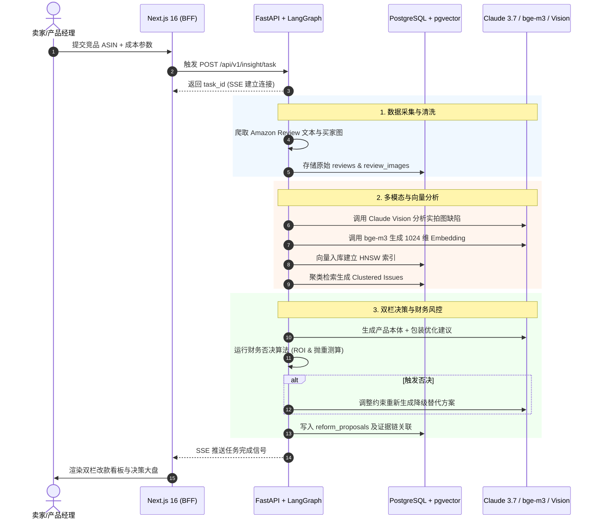

# InsightX · 全球跨境电商 AI 市场洞察与动态决策系统
# 产品需求文档 (PRD)

| 文档版本 | V1.0 | 编制日期 | 2026-08-22 |
| :--- | :--- | :--- | :--- |
| 项目名称 | InsightX | 适用阶段 | 比赛初赛/复赛 & MVP 研发 |
| 技术栈 | Next.js 16 + FastAPI + LangGraph + PostgreSQL/pgvector + Redis | 核心定位 | 工业级出海选品、改款决策与动态风控引擎 |

---

## 一、产品概述

### 1.1 产品愿景
打破传统跨境电商工具“只给图表不给方案、只推爆款不控风险、只抓文字不管实拍”的行业死结。InsightX 依托多源时序数据采集、多语言向量对齐与多模态 VLM 视觉取证，通过 LangGraph Agent 闭环驱动，为出海企业提供从“海量差评与竞品信号”到“工厂级双栏改款工程清单与逆向财务熔断”的全链路智能决策系统。

### 1.2 目标用户
**核心目标客群**：具备柔性制造与自主开模能力的**工贸一体出海企业、产业带白牌制造厂商及品牌型精细化卖家**（拥有供应链与工厂掌控力，能实质改款优化，非纯铺货跟卖卖家）。

### 1.3 核心价值主张 (Value Proposition)
1. **跨平台时序感知**：多平台（Amazon/TikTok Shop/Temu）同品类数据拉通与价格/流量穿透监控。
2. **多模态物理级诊断**：结合 Claude Vision 突破纯文本分词局限，对买家实拍差评图进行色差、破损、断裂等物理缺陷取证。
3. **工厂级双栏改款落地**：输出“产品物理本体优化”与“包装履约降本优化”工程级结构化清单。
4. **逆向财务与现金流否决**：内置开模成本、MOQ、抛重比与资金回流约束，向高危内卷项目主动发起熔断警告。
5. **端到端证据溯源与历史回测**：每条建议 100% 绑定原始 Review/图片证据链，支持时间切片后验回测。

---

## 二、用户角色与场景 (User Personas & Scenarios)

| 用户角色 | 核心使用场景 | 核心痛点与诉求 | 期望交付物 (Deliverables) |
| :--- | :--- | :--- | :--- |
| **选品负责人**<br>(Product Sourcing Head) | 新品立项调研、蓝海细分市场发掘、竞品进入壁垒分析 | 依赖人工翻查 H10/JS，缺乏对竞品真实痛点的量化统计；盲目跟风导致进入红海价格战 | • 五维可行性雷达评分<br>• 竞品痛点差异化机会清单<br>• 蓝海价格带与规格空白建议 |
| **产品经理 (PM)**<br>(Hardware / Industrial PM) | 老品改版升级、新品工程定义、打样与模具需求制定 | 传统 VOC 无法区分是“包装摔坏”还是“模具公差”，无法直接给工程图纸提需求 | • 结构化双栏改款清单（本体 vs 包装）<br>• VLM 实拍图缺陷取证报告<br>• 结构防呆与材料升级规格表 |
| **定价与运营**<br>(Operations & Pricing Lead) | 日常价格变动监控、Coupon/促销对冲、Buy Box 防守与掠夺 | 竞品降价或上促销无法小时级感知，被动失守 Buy Box 导致排名腰斩 | • 分钟/小时级竞对异动告警<br>• 智能调价幅度与毛利影响模拟<br>• 历史价格弹性分析曲面 |
| **供应链与库存**<br>(Supply Chain Specialist) | 备货批量决策、包材体积重优化、物流破损防范 | 尺寸超规导致 FBA 履约费暴涨；工厂打样开模周期过长导致错失品类窗口期 | • 包装外箱尺寸降级（Tier Down）方案<br>• FBA 运费节约测算表<br>• 早期质量预警与批次安全库存建议 |
| **企业老板/决策者**<br>(Business Owner / GM) | 立项审批、开模资金拨付、重大战略风险把控 | 工具只吹爆款潜力，隐瞒开模失败、滞销压仓及资金链断裂风险 | • 动态现金流与 ROI 否决/熔断报告<br>• 每周市场竞争打法与选品战略摘要 |

---

## 三、功能清单 (Feature Roadmap)

### 3.1 优先级定义
- **P0（MVP / 初赛核心）**：单平台（Amazon）评论采集、bge-m3 痛点聚类、双栏改款生成、可视化大盘。
- **P1（复赛深化）**：Claude Vision 买家实拍图多模态取证、开模与履约成本逆向否决、全链路证据反查。
- **P2（演进扩展）**：历史时间切片回测验证、跨平台（TikTok/Temu）数据对齐、供应链舆情信号监控。

### 3.2 详细功能矩阵

#### 【P0 功能模块】
```
[P0-01] 竞品 ASIN 评论与元数据采集引擎
- 描述：支持输入单个或批量 Amazon ASIN，自动抓取商品元数据（标题、价格、BSR、尺寸重量）及近 6 个月差评/好评文本。
- 用户故事：As a 选品负责人, I want to 输入竞品 ASIN 即可一键抓取全量核心元数据与差评, So that 不需要手工导出 Excel 或购买昂贵零散插件。
- 验收标准：
  1. 支持标准 10 位 ASIN 校验，单次提交支持 1-10 个竞品。
  2. 抓取成功率 >= 95%，自动剔除无意义短评（如 "ok", "fast"）。
  3. 结构化保存至 PostgreSQL 数据库 reviews 表中。

[P0-02] 多语言痛点语义对齐与聚类分析
- 描述：使用 bge-m3 向量模型对多语言评论生成 1024 维 Dense 向量，基于 pgvector 进行相似度聚类，归纳 Top 5 核心质量痛点。
- 用户故事：As a 产品经理, I want to 看到系统自动按严重度和频次汇总的买家高频痛点, So that 我无需人工逐条阅读几千条外语评论。
- 验收标准：
  1. 准确将差评归类为质量、功能、尺寸、配件、说明书等标准维度。
  2. 聚类输出包含：痛点名称、出现频次、严重度评分（1-5分）、典型原声摘录。
  3. 德/日/西等多语言评论自动对齐到统一中文/英文标签。

[P0-03] 结构化双栏改款建议生成引擎
- 描述：基于痛点聚类结果，LLM 生成“产品本体优化”与“包装履约优化”两栏可落地改进方案。
- 用户故事：As a 产品经理/供应链专家, I want to 获得清晰拆解为产品改款和包装改进的工程清单, So that 我能分别对接模具厂与包装厂。
- 验收标准：
  1. 严格分为两栏输出：左栏（材质、结构、模具公差）、右栏（包材抗震、尺寸降阶、组装说明）。
  2. 每条方案具备具体改动描述、预期解决的痛点编号。
  3. 前端以双栏卡片对照形式清晰展示。

[P0-04] 交互式洞察大盘与任务流看板 (Dashboard)
- 描述：统一的 Next.js 16 Web 界面，展示任务执行进度、核心指标卡片、差评痛点分布图表及改款决策报告。
- 用户故事：As a 决策者, I want to 在一个页面总览所有监控 ASIN 的关键指标与诊断结果, So that 快速评估竞品态势。
- 验收标准：
  1. 包含核心 KPI 卡片（平均星级、差评率、改款潜力指数、预测 FBA 节约额）。
  2. 集成 ECharts 差评痛点分布柱状/雷达图。
  3. 支持 SSE 流式展示 Agent 运行节点状态。
```

#### 【P1 功能模块】
```
[P1-01] VLM 买家实拍图多模态缺陷取证
- 描述：使用 Claude Vision 对买家差评实拍图进行视觉识别，提取色差、运输破损、结构断裂、毛刺飞边等缺陷。
- 用户故事：As a 产品经理, I want to 看到买家实拍图中产品具体损坏部位的标注与成因分析, So that 避免因文字描述模糊导致改错模具。
- 验收标准：
  1. 提取有效买家实拍图并过滤无关图（包装袋、无关背景）。
  2. 输出结构化缺陷标注（缺陷类型、置信度、断裂/破损物理归因）。
  3. 视觉证据与对应评论、改款建议精准绑定。

[P1-02] 逆向财务约束与现金流否决引擎 (Financial Veto)
- 描述：录入开模成本、打样周期、预估销量、抛重比等参数，若项目 ROI 不达标或回本周期超限，强制触发熔断否决。
- 用户故事：As a 决策者/老板, I want to 系统在预期收益无法覆盖改款成本或周期过长时主动叫停, So that 避免盲目投入导致资金链断裂。
- 验收标准：
  1. 支持自定义输入模具费（USD）、MOQ、当前毛利率、期望回本月数。
  2. 触发否决条件（如：改款成本增额 > 毛利 35% 或 研发周期 > 品类半衰期）时输出红色警示与打回理由。
  3. 提供降级替代方案提示（如：免开模小改、仅优化包装）。

[P1-03] 全链路证据端到端反向溯源
- 描述：决策报告中每一项痛点与改款建议均可点击穿透，查看支撑该结论的原始 Review 文本、时间戳、星级、原声翻译及实拍图。
- 用户故事：As a 运营负责人, I want to 点击改款建议直接看到对应的真实差评出处, So that 确保 AI 建议真实可信而非模型幻觉。
- 验收标准：
  1. 改款卡片标注引用证据数量（如：Based on 42 Reviews & 8 Photos）。
  2. 点击抽屉弹窗展开原始证据列表，支持按星级、时间筛选。
  3. 证据高亮显示核心抱怨关键词。
```

#### 【P2 功能模块】
```
[P2-01] 历史时间切片回测验证系统 (Backtesting)
- 描述：按时间截断历史数据（如取 2025 年 Q1 数据），由 Agent 给出改款建议，对比该品类后续真实市场演变，计算预测吻合度。
- 用户故事：As a 选品负责人, I want to 查看模型在历史时间节点上的建议是否与后来爆款走势一致, So that 建立对系统决策逻辑的信任。
- 验收标准：
  1. 支持选择历史时间切片点（如 6 个月前）。
  2. 输出后验吻合度评分（Backtest Accuracy Score）。

[P2-02] 跨平台 SKU 动态映射与套利空间洞察
- 描述：打通 TikTok Shop 与 Temu 数据，基于跨语种图文特征实现同款商品自动对齐，发现价格差与供需洼地。
- 用户故事：As a 选品与定价运营, I want to 看到同款商品在 Amazon、TikTok、Temu 的价格差异与流量热度, So that 制定跨平台出海定价打法。
- 验收标准：
  1. 实现跨平台同款 SKU 自动推荐度匹配（Match Score）。
  2. 提供三平台价格对比与佣金履约成本测算表。

[P2-03] 供应链风险与物流异常预警
- 描述：监控公开运价指数、海运港口拥堵、原材料价格波动与工厂交期舆情，输出安全库存微调建议。
- 用户故事：As a 供应链负责人, I want to 提前获取关键原材料涨价与航线延误信号, So that 提前调整采购节奏与出运计划。
```

---

## 四、信息架构与导航设计 (Information Architecture)

```
InsightX 平台架构
├── 顶栏导航 (Header)
│   ├── 项目/品类切换选择器
│   ├── 快速创建诊断任务 (New Audit Task)
│   ├── 系统实时告警中心 (Alerts)
│   └── 用户与企业账套设置 (Settings)
│
├── 侧边栏主导航 (Sidebar Navigation)
│   ├── 1. 战略决策大盘 (Overview Dashboard)
│   │   ├── 核心 KPI 卡片区
│   │   ├── 任务执行进度与实时流
│   │   └── 风险熔断待办项
│   │
│   ├── 2. 竞品时序监控 (Competitor Radar)
│   │   ├── 竞品列表与 BSR 走势
│   │   ├── 价格与 Buy Box 波动监控
│   │   └── 跨平台 SKU 映射矩阵 (P2)
│   │
│   ├── 3. 多模态评论洞察 (VOC & Vision Audit)
│   │   ├── 痛点聚类分析分布
│   │   ├── 买家实拍图缺陷画廊
│   │   └── 多语言声量情感矩阵
│   │
│   ├── 4. 工厂级改款决策 (Reformulation Engine)
│   │   ├── 双栏决策看板（产品本体 vs 包装履约）
│   │   ├── 证据链穿透抽屉 (Evidence Trace)
│   │   └── 改款工程规格书导出 (PDF/Excel)
│   │
│   └── 5. 逆向财务与风控熔断 (Financial Guard)
│       ├── 开模成本与 ROI 测算器
│       ├── 包装抛重与 FBA 降档模拟
│       └── 历史回测验证中心 (P2)
```

---

## 五、核心页面描述与交互规范

### 5.1 战略决策大盘 (Dashboard)
- **页面定位**：系统首屏，聚合展示企业监控品类的全局体检状态、待处理高危竞品及改款机会推荐。
- **布局要点**：
  1. **Top KPI Row**：监控竞品数、高频痛点收敛数、潜在可降本 FBA 资金池（$）、触发风控熔断数。
  2. **任务流快速触发器**：输入 Amazon ASIN / URL + 目标站点 + 预估开模预算，一键触发 LangGraph 任务。
  3. **实时 Agent 执行流面板**：采用 SSE 流式展示 7 步节点推进动画与耗时，展示状态机跳转与状态日志。
  4. **高潜改款项目推荐卡片**：展示近期分析完成的 Top 3 推荐品类，标明预估 ROI 与退货率压降预期。

### 5.2 多模态评论洞察页 (VOC & Vision Audit)
- **页面定位**：深度展示从文本评论与实拍图中挖掘出的物理缺陷分布。
- **布局要点**：
  1. **痛点聚类排行榜**：左侧展示 Top 痛点树状列表，带严重度徽章（Critical / Moderate / Minor）及频次百分比。
  2. **多模态取证画廊**：右侧展示买家实拍图网格，每张图叠加 VLM 识别出的缺陷边界框（如“把手断裂处”、“外壳色差”），附带置信度与模型归因解释。
  3. **多语言过滤条**：支持切换德语、日语、西语原声与翻译对照视图，支持按 1-3 星筛选理性吐槽评论。

### 5.3 工厂级双栏改款决策页 (Reformulation Engine)
- **页面定位**：核心交付物页面，直观呈现面向工程与供应链的落地方案。
- **布局要点**：
  1. **左栏：产品物理优化栏 (Product Body Optimization)**
     - 结构设计防呆、材质替换等级（如 ABS $\rightarrow$ 阻燃 PC）、模具拔模斜度修正。
     - 标注：预计开模费用（$）、改模周期（天）、预计降低产品自身缺陷率（%）。
  2. **右栏：包装与履约优化栏 (Packaging & Fulfillment Optimization)**
     - 包装材料抗摔升级（如蜂窝纸板垫块）、外箱几何尺寸缩减方案。
     - 标注：外箱尺寸变化对比（$L \times W \times H$）、抛重变化、FBA Size Tier 变化、单件运费节省额（$）。
  3. **交互规范**：
     - 每条建议右侧带“查看证据链”按钮，点击后右侧滑出抽屉，高亮呈现对应原始评论与图表证据。
     - 底部提供“一键导出工程改款任务书 (Engineering RFC)”按钮。

### 5.4 逆向财务风控与熔断详情页 (Financial Guard)
- **页面定位**：把控商业合理性，防止盲目开模与高危立项。
- **布局要点**：
  1. **财务参数调节滑块**：用户可动态拖动开模预算、打样成本、首批 MOQ、预期售价、当前海运单价。
  2. **动态盈亏平衡与敏感度曲线**：ECharts 动态展示不同退货率降低幅度下的投资回收期（Payback Period）。
  3. **熔断决议状态区 (Veto Banner)**：
     - **PASSED（绿灯）**：方案财务指标健康，ROI >= 预期门槛。
     - **VETOED（红灯熔断）**：显示醒目熔断警示标签，给出明确劝退理由（如：“开模回收期长达 14 个月，已超出该品类 6 个月生命周期”），并自动给出免开模的替代建议。

---

## 六、数据流与状态机说明 (Dataflow & State Machine)

### 6.1 端到端数据流转图


### 6.2 LangGraph 全局状态机模型 (InsightState)
```python
class InsightState(TypedDict):
    task_id: str                      # 任务唯一 ID
    asin: str                         # 目标竞品 ASIN
    target_platform: str              # 平台 (amazon/tiktok/temu)
    raw_reviews: List[ReviewItem]     # 原始评论列表
    visual_evidences: List[VisualEv]  # VLM 实拍图分析结果
    clustered_issues: List[Cluster]   # 痛点聚类结果
    proposals: List[ReformProposal]   # 双栏改款提议列表
    financial_constraint: Dict        # 成本预算与财务约束
    veto_status: str                  # 'PASSED' | 'VETOED'
    evidence_links: List[EvidenceMap] # 方案到原始评论的关联映射
    retry_count: int                  # 财务打回重试计数
    current_node: str                 # 当前执行节点名
```

---

## 七、非功能性需求 (NFR)

### 7.1 性能与响应时效 (Performance)
1. **BFF 接口响应**：基础查询接口 P95 延迟 <= 200ms。
2. **异步任务吞吐**：单 ASIN 500 条评论的全链路分析（抓取 $\rightarrow$ 向量化 $\rightarrow$ VLM 取证 $\rightarrow$ 建议生成）在 30 秒至 60 秒内完成。
3. **向量检索性能**：pgvector 在 10 万条评论级数据集上，Top 50 混合余弦检索耗时 <= 50ms。
4. **SSE 流式延迟**：Agent 节点状态变动至前端展示延迟 <= 300ms。

### 7.2 安全与合规性 (Security & Compliance)
1. **数据隐私隔离**：支持多租户（Tenant）逻辑隔离，企业自定义财务数据与改款图纸数据强加密存储。
2. **API 密钥与凭证安全**：Anthropic / Keepa API Key 严禁硬编码，统一由后端环境与密钥管理系统加载。
3. **合规采集**：爬虫模块严格遵守速率限制与公开数据访问规范，规避封禁与侵权风险。

### 7.3 可用性与容错 (Availability & Reliability)
1. **服务可用性**：系统正常运行时间 SLA >= 99.5%。
2. **大模型调用容错**：对外调用 LLM/VLM 需配置指数退避重试（最多 3 次），配置降级兜底逻辑（如 VLM 识别异常时不阻断文本分析）。
3. **数据幂等性**：同一 ASIN 的重复分析任务复用缓存期内的数据切片，防止重复计算与 Token 浪费。

---

## 八、MVP 范围定义 (Scope Definition)

```
+-------------------------------------------------------------------------+
|                              MVP 范围划分                                |
+------------------------------------+------------------------------------+
|         初赛阶段 (MVP 核心基线)       |        复赛阶段 (完整全功能演进)       |
+------------------------------------+------------------------------------+
| 1. 单平台闭环：聚焦 Amazon US 站点   | 1. 多平台扩展：接入 TikTok Shop 与  |
|    单品类（如：家居/3C小家电）。      |    Temu，支持跨平台同款映射。       |
| 2. 评论采集与清洗：抓取 200-500 条  | 2. 深度视觉分析：买家图缺陷局部高亮  |
|    典型 Review。                   |    框选与材质比对。                |
| 3. bge-m3 痛点聚类：提取 Top 5 痛点 | 3. 复杂财务风控：多阶梯 FBA 运费测算 |
|    及严重度评分。                   |    与开模供应链周期动态熔断。        |
| 4. 双栏改款建议：生成本体优化与包装  | 4. 历史时间切片回测验证系统与吻合度  |
|    优化结构化方案。                 |    得分计算。                      |
| 5. 可视化大盘：Next.js 16 看板展示   | 5. 供应链信号与原材料海运波动预警。  |
|    及 SSE 节点推进流。             | 6. 自动化导出专业级工程改款 RFC     |
| 6. 基础证据溯源：卡片关联原始评论。   |    (PDF/Word)。                    |
+------------------------------------+------------------------------------+
```

---

## 九、里程碑与排期建议 (Milestones & Schedule)

| 阶段 | 周期 | 核心里程碑交付物 | 关键责任模块 |
| :--- | :--- | :--- | :--- |
| **M1: 架构与原型搭设** | 第 1 周 (Day 1-7) | • Monorepo 仓库初始化<br>• PostgreSQL/pgvector 数据库表结构初始化<br>• Next.js 16 UI 框架与 Dashboard 原型搭建 | 全员 / 前端 |
| **M2: P0 核心数据与算法闭环** | 第 2 周 (Day 8-14) | • Amazon 评论抓取与清洗管道联通<br>• bge-m3 向量化与 pgvector HNSW 检索跑通<br>• LangGraph 双栏改款 Agent 生成测试通过 | 后端 / AI 核心 |
| **M3: 前后端联调与初赛交付** | 第 3 周 (Day 15-21) | • Next.js BFF 与 FastAPI SSE 状态流透传<br>• 双栏决策看板 + 证据链抽屉交互联调<br>• **完成初赛 Demo 录屏与申报材料提交** | 全员 |
| **M4: P1 多模态与财务风控增强** | 第 4 周 (Day 22-28) | • 接入 Claude Vision 买家实拍图缺陷解析<br>• 财务否决熔断逻辑与抛重降阶算法上线<br>• 证据反向穿透交互完善 | AI 核心 / 后端 |
| **M5: P2 回测体系与多平台扩展** | 第 5 周 (Day 29-35) | • 接入 TikTok/Temu 样本数据<br>• 历史时间切片回测验证模块交付<br>• 性能调优与压测 | 全员 |
| **M6: 决赛演练与上线发布** | 第 6 周 (Day 36-40) | • Docker Compose 一键部署验证<br>• 现场演示 PPT、Demo 演讲稿与防翻车预案准备 | 全员 / 队长 |

---
*文档编制完成，符合大赛技术方案规范与落地执行标准。*
